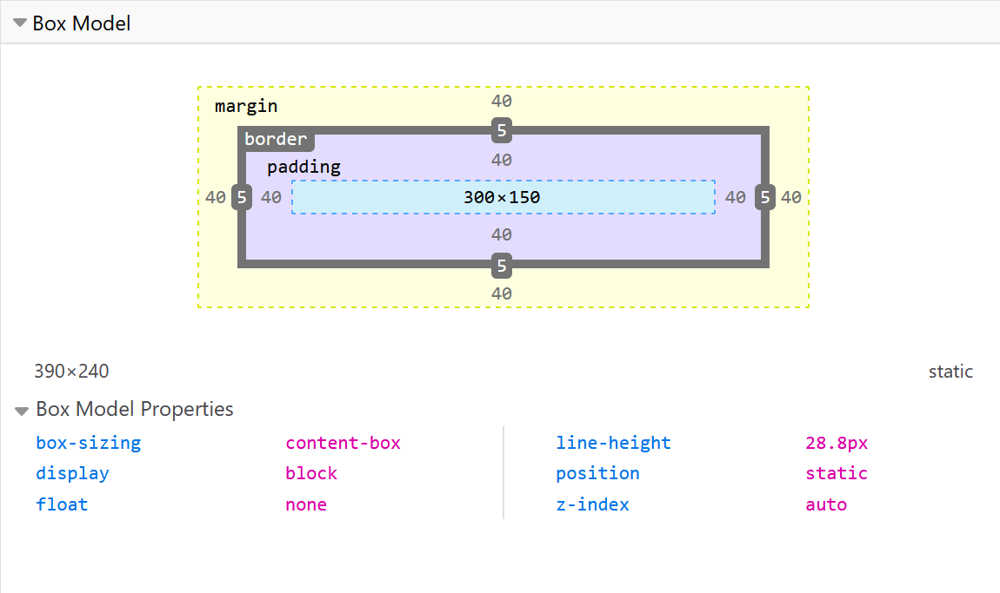

# CSS 层叠样式表

Cascading Style Sheets


[TOC]

## 总览

##### css样式

```css
h1 {                    /*选择器*/ 
    color: red;			/*样式*/
    font-size: 5em;
}
```
##### 外部样式表

```html
 <link rel="stylesheet" href="styles.css">
```
##### 内部样式表

```html
<head>
    <meta charset="utf-8">
    <title>My CSS experiment</title>
    <style>
      h1 {
        color: blue;
        background-color: yellow;
        border: 1px solid black;
      }

      p {
        color: red;
      }
    </style>
</head>
```


##### 注释

```css
# css注释：
/*这是单行注释*/
/*
    这是多行注释
    这是多行注释
*/
```

##### 元素

[如何构建CSS - 学习 Web 开发 | MDN (mozilla.org)](https://developer.mozilla.org/zh-CN/docs/Learn/CSS/First_steps/How_CSS_is_structured)

##### CSS究竟是怎么工作的？

当浏览器展示一个文件的时候，它必须兼顾文件的内容和文件的样式信息，下面我们会了解到它处理文件的标准的流程。需要知道的是，下面的步骤是浏览加载网页的简化版本，而且不同的浏览器在处理文件的时候会有不同的方式，但是下面的步骤基本都会出现。

1. 浏览器载入HTML文件（比如从网络上获取）。

2. 将HTML文件转化成一个DOM（Document Object Model），DOM是文件在计算机内存中的表现形式，下一节将更加详细的解释DOM。
3. 接下来，浏览器会拉取该HTML相关的大部分资源，比如嵌入到页面的图片、视频和CSS样式。JavaScript则会稍后进行处理。
4. 浏览器拉取到CSS之后会进行解析，根据选择器的不同类型（比如element、class、id等等）把他们分到不同的“桶”中。浏览器基于它找到的不同的选择器，将不同的规则（基于选择器的规则，如元素选择器、类选择器、id选择器等）应用在对应的DOM的节点中，并添加节点依赖的样式（这个中间步骤称为渲染树）。
5. 上述的规则应用于渲染树之后，渲染树会依照应该出现的结构进行布局。
6. 网页展示在屏幕上（这一步被称为着色）。

## 模块

#### 颜色

```css
/* 关键词 */
color: currentcolor;

/* <named-color>值 */
color: red;
color: orange;
color: tan;
color: rebeccapurple;

/* <hex-color>值 */
color: #090;
color: #009900;
color: #090a;
color: #009900aa;

/* <rgb()>值 */
color: rgb(34, 12, 64, 0.6);
color: rgba(34, 12, 64, 0.6);
color: rgb(34 12 64 / 0.6);
color: rgba(34 12 64 / 0.3);
color: rgb(34.0 12 64 / 60%);
color: rgba(34.6 12 64 / 30%);

/* <hsl(a)>值 */
/*Hue, Saturation, Lightness，(alpha)
色相 饱和度 亮度 透明度*/
color: hsl(30, 100%, 50%, 0.6);
color: hsla(30, 100%, 50%, 0.6);
color: hsl(30 100% 50% / 0.6);
color: hsla(30 100% 50% / 0.6);
color: hsl(30.0 100% 50% / 60%);
color: hsla(30.2 100% 50% / 60%);

/* 全局值 */
color: inherit;
color: initial;
color: unset;
```


#### 字体指定

```css
/* 一个字体族名和一个通用字体族名 */
font-family: "Gill Sans Extrabold", sans-serif;
font-family: "Goudy Bookletter 1911", sans-serif;
/*无空格时可不加双引号*/

/* 仅有一个通用字体族名 */
font-family: serif;
font-family: sans-serif;
font-family: monospace;    #等宽
font-family: cursive;
font-family: fantasy;	#艺术字
font-family: system-ui;
font-family: emoji;
font-family: math;
font-family: fangsong;	#仿宋

/* 全局值 */
font-family: inherit;
font-family: initial;
font-family: unset;

```

#### 字体粗细

```css
/* Keyword values */
font-weight: normal;	#400
font-weight: bold;		#700

/* Keyword values relative to the parent */
font-weight: lighter;	#比从父元素继承来的值更细
font-weight: bolder;

/* Numeric keyword values 
1-1000    四舍五入转化为100的整数倍*/
font-weight: 1
font-weight: 100;
font-weight: 100.6;
font-weight: 123;
~~~
font-weight: 1000;

/* Global values */
```

#### 字体大小

```css
/* <absolute-size>，绝对大小值 */
font-size: xx-small;
font-size: x-small;
font-size: small;
font-size: medium;
font-size: large;
font-size: x-large;
font-size: xx-large;

/* <relative-size>，相对大小值 */
font-size: larger;
font-size: smaller;

/* <length>，长度值 */
font-size: 12px;	#像素值
font-size: 0.8em;	#相对于继承属性的比例
/*em = 希望得到的像素大小 / 父元素字体像素大小*/

/* <percentage>，百分比值 */
font-size: 80%;

font-size: inherit;
```

#### 文本修饰text-decoration

```
text-decoration-line
文本修饰的位置,
如下划线underline，删除线line-through

text-decoration-color
文本修饰的颜色

text-decoration-style
文本修饰的样式
如波浪线wavy实线solid虚线dashed

text-decoration-thickness
文本修饰线的粗细
```

#### 不同方向的文本


```css
writing-mode: 

horizontal-tb: 块流向从上至下。对应的文本方向是横向的。(默认）)
vertical-rl: 块流向从右向左。对应的文本方向是纵向的。
vertical-lr: 块流向从左向右。对应的文本方向是纵向的。

```

- **块**维度指的总是块在页面书写模式下的**显示**方向。

- **内联**维度指的总是**文本**方向。

#### 映射属性（逻辑属性）

这些属性用逻辑（**logical**）和相对变化（**flow relative**）代替了像宽`width`和高`height`一样的物理属性。

横向书写模式下，映射到`width`的属性被称作内联尺寸（[`inline-size`](https://developer.mozilla.org/zh-CN/docs/Web/CSS/inline-size)）——内联维度的尺寸。而映射`height`的属性被称为块级尺寸（[`block-size`](https://developer.mozilla.org/zh-CN/docs/Web/CSS/block-size)），这是块级维度的尺寸。


#### 边框

```css
border-bottom: 1px;
border-bottom: 2px dotted;
border-bottom: medium dashed blue;
```

```css
/* width */
/* Keyword values */
border-bottom-width: thin;
border-bottom-width: medium;
border-bottom-width: thick;

/* <length> values */
border-bottom-width: 10em;
border-bottom-width: 3vmax;
border-bottom-width: 6px;

/* Global keywords */
border-bottom-width: inherit;
border-bottom-width: initial;
border-bottom-width: unset;
```
```css
/*style*/
/* Keyword values */
border-bottom-style: none;
border-bottom-style: hidden;
border-bottom-style: dotted;
border-bottom-style: dashed;
border-bottom-style: solid;
border-bottom-style: double;
border-bottom-style: groove;
border-bottom-style: ridge;
border-bottom-style: inset;
border-bottom-style: outset;

/* Global values */
```

```css
/*color*/
border-bottom-color: yellow;
border-bottom-color: #F5F6F7;
```

```css
/*圆角*/
.box {
  border-radius: 10px;	- 圆角半径
  border-top-right-radius: 1em 10%;	 - 右上角水平半径为1em，垂直半径为10%
  
} 
```


## 构建

### 层叠 优先级 继承

#### 冲突规则

- 相同优先级的规则，顺序在最后的生效

- 优先级不同，优先级高的生效

​		*类选择* > *元素选择*

#### /* Global keywords */

`inherit`
设置该属性会使子元素属性和**父元素**相同。实际上，就是 "开启继承".
`initial`
设置属性值和浏览器**默认样式**相同。如果浏览器默认样式中未设置且该属性是自然继承的，那么会设置为 inherit 。
`unset`
将属性重置为**自然值**，也就是如果属性是自然继承那么就是 inherit，否则和 initial一样

#### 重设所有属性值

CSS 的 shorthand 属性 **all** 可以用于同时将这些继承值中的一个应用于（几乎）所有属性。它的值可以是其中任意一个(inherit, initial, unset, or revert)。这是一种撤销对样式所做更改的简便方法，以便回到之前已知的起点。

```css
.fix-this {
    all: unset;
}
```

#### 优先级计算

一个选择器的优先级可以说是由四个部分相加 (分量)，可以认为是个十百千 — 四位数的四个位数：

1. **千位**： 如果声明在 **style的属性**（内联样式）则该位得一分。这样的声明没有选择器，所以它得分总是1000。
2. **百位**： 选择器中包含**ID**选择器则该位得一分。
3. **十位**： 选择器中包含**类**选择器、**属性**选择器或者**伪类**则该位得一分。
4. **个位**：选择器中包含**元素、伪元素**选择器则该位得一分。
5. 不允许进行进位
6. `!important`可以用来覆盖所有上面所有优先级计算，用于修改特定属性的值， 能够覆盖普通规则的层叠。

### 选择器

#### 类型、类和ID选择器

```css
指向了所有HTML元素<h1>。
h1 { }

class的选择器：
.box { }
选择文档中应用了这个类的所有物件

id选择器：
#unique { }
以#开头

全局选择器
article *:first-child {
} 
```

#### 标签属性选择器

```css
a[title] { }

# 根据一个有特定值的标签属性是否存在来选择：
a[href="https://example.com"] { }


# 一个或多个属性中至少有一个和VALUE匹配
p[class~="special"]

# 值正为value，或者开始为value，后面紧随着一个连字符。
div[lang|="zh"]

# 其值开头为value子字符串
li[class^="box-"]

# 值结尾为value子字符串
li[class$="-box"]

# 至少出现了一次value子字符串
li[class*="box"]

# 大小写不敏感 在]之前写一个 i
li[class^="a" i] {
    color: red;
}
```

#### 伪类与伪元素选择器

这组选择器包含了伪类，用来样式化一个元素的特定状态。

```css
/*例如`:hover`伪类会在鼠标指针悬浮到一个元素上的时候选择这个元素：*/
a:hover { }

/*它还可以包含了伪元素，选择一个元素的某个部分而不是元素自己。例如，::first-line是会选择一个元素（下面的情况中是<p>）中的第一行，类似<span>包在了第一个被格式化的行外面，然后选择这个<span>。*/
p::first-line { }

/*伪类是开头为冒号的关键字*/
p:first-child
p:last-child
p:only-child	# 没有任何兄弟元素的元素
p:invalid	# 表示任意内容未通过验证的<input> 或其他 <form> 元素
```

##### [伪类](https://developer.mozilla.org/zh-CN/docs/Learn/CSS/Building_blocks/Selectors/Pseudo-classes_and_pseudo-elements#伪类)

| 选择器                                                       | 描述                                                         |
| :----------------------------------------------------------- | :----------------------------------------------------------- |
| [`:active`](https://developer.mozilla.org/zh-CN/docs/Web/CSS/:active) | 在用户激活（例如点击）元素的时候匹配。                       |
| [`:any-link`](https://developer.mozilla.org/zh-CN/docs/Web/CSS/:any-link) | 匹配一个链接的`:link`和`:visited`状态。                      |
| [`:blank`](https://developer.mozilla.org/zh-CN/docs/Web/CSS/:blank) | 匹配空输入值的[``元素](https://developer.mozilla.org/en-US/docs/Web/HTML/Element/input)。 |
| [`:checked`](https://developer.mozilla.org/zh-CN/docs/Web/CSS/:checked) | 匹配处于选中状态的单选或者复选框。                           |
| [`:current` (en-US)](https://developer.mozilla.org/en-US/docs/Web/API/WebVTT_API) | 匹配正在展示的元素，或者其上级元素。                         |
| [`:default`](https://developer.mozilla.org/zh-CN/docs/Web/CSS/:default) | 匹配一组相似的元素中默认的一个或者更多的UI元素。             |
| [`:dir`](https://developer.mozilla.org/zh-CN/docs/Web/CSS/:dir) | 基于其方向性（HTML`dir`属性或者CSS`direction`属性的值）匹配一个元素。 |
| [`:disabled`](https://developer.mozilla.org/zh-CN/docs/Web/CSS/:disabled) | 匹配处于关闭状态的用户界面元素                               |
| [`:empty`](https://developer.mozilla.org/zh-CN/docs/Web/CSS/:empty) | 匹配除了可能存在的空格外，没有子元素的元素。                 |
| [`:enabled`](https://developer.mozilla.org/zh-CN/docs/Web/CSS/:enabled) | 匹配处于开启状态的用户界面元素。                             |
| [`:first`](https://developer.mozilla.org/zh-CN/docs/Web/CSS/:first) | 匹配[分页媒体](https://developer.mozilla.org/en-US/docs/Web/CSS/Paged_Media)的第一页。 |
| [`:first-child`](https://developer.mozilla.org/zh-CN/docs/Web/CSS/:first-child) | 匹配兄弟元素中的第一个元素。                                 |
| [`:first-of-type`](https://developer.mozilla.org/zh-CN/docs/Web/CSS/:first-of-type) | 匹配兄弟元素中第一个某种类型的元素。                         |
| [`:focus`](https://developer.mozilla.org/zh-CN/docs/Web/CSS/:focus) | 当一个元素有焦点的时候匹配。                                 |
| [`:focus-visible`](https://developer.mozilla.org/zh-CN/docs/Web/CSS/:focus-visible) | 当元素有焦点，且焦点对用户可见的时候匹配。                   |
| [`:focus-within`](https://developer.mozilla.org/zh-CN/docs/Web/CSS/:focus-within) | 匹配有焦点的元素，以及子代元素有焦点的元素。                 |
| [`:future` (en-US)](https://developer.mozilla.org/en-US/docs/Web/CSS/:future) | 匹配当前元素之后的元素。                                     |
| [`:hover`](https://developer.mozilla.org/zh-CN/docs/Web/CSS/:hover) | 当用户悬浮到一个元素之上的时候匹配。                         |
| [`:indeterminate`](https://developer.mozilla.org/zh-CN/docs/Web/CSS/:indeterminate) | 匹配未定态值的UI元素，通常为[复选框](https://developer.mozilla.org/en-US/docs/Web/HTML/Element/input/checkbox)。 |
| [`:in-range`](https://developer.mozilla.org/zh-CN/docs/Web/CSS/:in-range) | 用一个区间匹配元素，当值处于区间之内时匹配。                 |
| [`:invalid`](https://developer.mozilla.org/zh-CN/docs/Web/CSS/:invalid) | 匹配诸如`<input>`的位于不可用状态的元素。                    |
| [`:lang`](https://developer.mozilla.org/zh-CN/docs/Web/CSS/:lang) | 基于语言（HTML[lang](https://developer.mozilla.org/zh-CN/docs/Web/HTML/Global_attributes/lang)属性的值）匹配元素。 |
| [`:last-child`](https://developer.mozilla.org/zh-CN/docs/Web/CSS/:last-child) | 匹配兄弟元素中最末的那个元素。                               |
| [`:last-of-type`](https://developer.mozilla.org/zh-CN/docs/Web/CSS/:last-of-type) | 匹配兄弟元素中最后一个某种类型的元素。                       |
| [`:left`](https://developer.mozilla.org/zh-CN/docs/Web/CSS/:left) | 在[分页媒体 (en-US)](https://developer.mozilla.org/en-US/docs/Web/CSS/CSS_Pages)中，匹配左手边的页。 |
| [`:link`](https://developer.mozilla.org/zh-CN/docs/Web/CSS/:link) | 匹配未曾访问的链接。                                         |
| [`:local-link` (en-US)](https://developer.mozilla.org/en-US/docs/Web/CSS/:local-link) | 匹配指向和当前文档同一网站页面的链接。                       |
| [`:is()`](https://developer.mozilla.org/zh-CN/docs/Web/CSS/:is) | 匹配传入的选择器列表中的任何选择器。                         |
| [`:not`](https://developer.mozilla.org/zh-CN/docs/Web/CSS/:not) | 匹配作为值传入自身的选择器未匹配的物件。                     |
| [`:nth-child`](https://developer.mozilla.org/zh-CN/docs/Web/CSS/:nth-child) | 匹配一列兄弟元素中的元素——兄弟元素按照an+b形式的式子进行匹配（比如2n+1匹配元素1、3、5、7等。即所有的奇数个）。 |
| [`:nth-of-type`](https://developer.mozilla.org/zh-CN/docs/Web/CSS/:nth-of-type) | 匹配某种类型的一列兄弟元素（比如，`<p>`元素）——兄弟元素按照an+b形式的式子进行匹配（比如2n+1匹配元素1、3、5、7等。即所有的奇数个）。 |
| [`:nth-last-child`](https://developer.mozilla.org/zh-CN/docs/Web/CSS/:nth-last-child) | 匹配一列兄弟元素，从后往前倒数。兄弟元素按照an+b形式的式子进行匹配（比如2n+1匹配按照顺序来的最后一个元素，然后往前两个，再往前两个，诸如此类。从后往前数的所有奇数个）。 |
| [`:nth-last-of-type`](https://developer.mozilla.org/zh-CN/docs/Web/CSS/:nth-last-of-type) | 匹配某种类型的一列兄弟元素（比如，`<p>`元素），从后往前倒数。兄弟元素按照an+b形式的式子进行匹配（比如2n+1匹配按照顺序来的最后一个元素，然后往前两个，再往前两个，诸如此类。从后往前数的所有奇数个）。 |
| [`:only-child`](https://developer.mozilla.org/zh-CN/docs/Web/CSS/:only-child) | 匹配没有兄弟元素的元素。                                     |
| [`:only-of-type`](https://developer.mozilla.org/zh-CN/docs/Web/CSS/:only-of-type) | 匹配兄弟元素中某类型仅有的元素。                             |
| [`:optional`](https://developer.mozilla.org/zh-CN/docs/Web/CSS/:optional) | 匹配不是必填的form元素。                                     |
| [`:out-of-range`](https://developer.mozilla.org/zh-CN/docs/Web/CSS/:out-of-range) | 按区间匹配元素，当值不在区间内的的时候匹配。                 |
| [`:past` (en-US)](https://developer.mozilla.org/en-US/docs/Web/CSS/:past) | 匹配当前元素之前的元素。                                     |
| [`:placeholder-shown`](https://developer.mozilla.org/zh-CN/docs/Web/CSS/:placeholder-shown) | 匹配显示占位文字的input元素。                                |
| [`:playing` (en-US)](https://developer.mozilla.org/en-US/docs/Web/CSS/:playing) | 匹配代表音频、视频或者相似的能“播放”或者“暂停”的资源的，且正在“播放”的元素。 |
| [`:paused` (en-US)](https://developer.mozilla.org/en-US/docs/Web/CSS/:paused) | 匹配代表音频、视频或者相似的能“播放”或者“暂停”的资源的，且正在“暂停”的元素。 |
| [`:read-only`](https://developer.mozilla.org/zh-CN/docs/Web/CSS/:read-only) | 匹配用户不可更改的元素。                                     |
| [`:read-write`](https://developer.mozilla.org/zh-CN/docs/Web/CSS/:read-write) | 匹配用户可更改的元素。                                       |
| [`:required`](https://developer.mozilla.org/zh-CN/docs/Web/CSS/:required) | 匹配必填的form元素。                                         |
| [`:right`](https://developer.mozilla.org/zh-CN/docs/Web/CSS/:right) | 在[分页媒体 (en-US)](https://developer.mozilla.org/en-US/docs/Web/CSS/CSS_Pages)中，匹配右手边的页。 |
| [`:root`](https://developer.mozilla.org/zh-CN/docs/Web/CSS/:root) | 匹配文档的根元素。                                           |
| [`:scope`](https://developer.mozilla.org/zh-CN/docs/Web/CSS/:scope) | 匹配任何为参考点元素的的元素。                               |
| [`:valid`](https://developer.mozilla.org/zh-CN/docs/Web/CSS/:valid) | 匹配诸如`<input>`元素的处于可用状态的元素。                  |
| [`:target`](https://developer.mozilla.org/zh-CN/docs/Web/CSS/:target) | 匹配当前URL目标的元素（例如如果它有一个匹配当前[URL分段](https://en.wikipedia.org/wiki/Fragment_identifier)的元素）。 |
| [`:visited`](https://developer.mozilla.org/zh-CN/docs/Web/CSS/:visited) | 匹配已访问链接。                                             |

##### [伪元素](https://developer.mozilla.org/zh-CN/docs/Learn/CSS/Building_blocks/Selectors/Pseudo-classes_and_pseudo-elements#伪元素)

| 选择器                                                       | 描述                                                 |
| :----------------------------------------------------------- | :--------------------------------------------------- |
| [`::after`](https://developer.mozilla.org/zh-CN/docs/Web/CSS/::after) | 匹配出现在原有元素的实际内容之后的一个可样式化元素。 |
| [`::before`](https://developer.mozilla.org/zh-CN/docs/Web/CSS/::before) | 匹配出现在原有元素的实际内容之前的一个可样式化元素。 |
| [`::first-letter`](https://developer.mozilla.org/zh-CN/docs/Web/CSS/::first-letter) | 匹配元素的第一个字母。                               |
| [`::first-line`](https://developer.mozilla.org/zh-CN/docs/Web/CSS/::first-line) | 匹配包含此伪元素的元素的第一行。                     |
| [`::grammar-error`](https://developer.mozilla.org/zh-CN/docs/Web/CSS/::grammar-error) | 匹配文档中包含了浏览器标记的语法错误的那部分。       |
| [`::selection`](https://developer.mozilla.org/zh-CN/docs/Web/CSS/::selection) | 匹配文档中被选择的那部分。                           |
| [`::spelling-error`](https://developer.mozilla.org/zh-CN/docs/Web/CSS/::spelling-error) | 匹配文档中包含了浏览器标记的拼写错误的那部分。       |


#### 关系选择器

##### 后代选择器

典型用单个空格（` `）字符——组合两个选择器，比如，第二个选择器匹配的元素被选择，如果他们有一个祖先（父亲，父亲的父亲，父亲的父亲的父亲，等等）元素匹配第一个选择器

##### 子代关系选择器

大于号（`>`），只会在选择器选中直接子元素的时候匹配。继承关系上更远的后代则不会匹配。例如，只选中作为`<article>`的直接子元素的`<p>`元素：

`article > p`

##### 邻接兄弟选择器

（`+`）用来选中恰好处于另一个在继承关系上同级的元素旁边的物件。例如，选中所有紧随`<p>`元素之后的``元素：

```css
p + img
```

##### 通用兄弟

如果你想选中一个元素的兄弟元素，即使它们不直接相邻，你还是可以使用通用兄弟关系选择器（`~`）。要选中所有的`<p>`元素后*任何地方*的``元素，我们会这样做：

```css
p ~ img
```


### CSS的值与单位

#### [数字，长度和百分比](https://developer.mozilla.org/zh-CN/docs/Learn/CSS/Building_blocks/Values_and_units#数字，长度和百分比)

您可能会发现自己在CSS中使用了各种数值数据类型。 以下全部归类为数值：

| 数值类型       | 描述                                                         |
| :------------- | :----------------------------------------------------------- |
| `<integer>`    | `<integer>`是一个整数，比如1024或-55。                       |
| `<number>`     | `<number>`表示一个小数——它可能有小数点后面的部分，也可能没有，例如0.255、128或-1.2。 |
| `<dimension>`  | `<dimension>`是一个`<number>`，它有一个附加的单位，例如45deg、5s或10px。`<dimension>`是一个伞形类别，包括`<length>`、`<angle>`、`<time>`和`<resolution>`类型。 |
| `<percentage>` | `<percentage>`表示一些其他值的一部分，例如50%。百分比值总是相对于另一个量，例如，一个元素的长度相对于其父元素的长度。 |

##### [长度](https://developer.mozilla.org/zh-CN/docs/Learn/CSS/Building_blocks/Values_and_units#长度)

最常见的数字类型是`<length>`，例如10px(像素)或30em。CSS中有两种类型的长度——相对长度和绝对长度。重要的是要知道它们之间的区别，以便理解他们控制的元素将变得有多大。

##### 绝对长度单位

以下都是**绝对**长度单位——它们与其他任何东西都没有关系，通常被认为总是相同的大小。

| 单位 | 名称         | 等价换算            |
| :--- | :----------- | :------------------ |
| `cm` | 厘米         | 1cm = 96px/2.54     |
| `mm` | 毫米         | 1mm = 1/10th of 1cm |
| `Q`  | 四分之一毫米 | 1Q = 1/40th of 1cm  |
| `in` | 英寸         | 1in = 2.54cm = 96px |
| `pc` | 十二点活字   | 1pc = 1/6th of 1in  |
| `pt` | 点           | 1pt = 1/72th of 1in |
| `px` | 像素         | 1px = 1/96th of 1in |

这些值中的大多数在用于打印时比用于屏幕输出时更有用。例如，我们通常不会在屏幕上使用cm。惟一一个您经常使用的值，估计就是px(像素)。

##### 相对长度单位

相对长度单位相对于其他一些东西，比如父元素的字体大小，或者视图端口的大小。使用相对单位的好处是，经过一些仔细的规划，您可以使文本或其他元素的大小与页面上的其他内容相对应。下表列出了web开发中一些最有用的单位。

| 单位   | 相对于                                                       |
| :----- | :----------------------------------------------------------- |
| `em`   | 在 font-size 中使用是相对于父元素的字体大小，在其他属性中使用是相对于自身的字体大小，如 width |
| `ex`   | 字符“x”的高度                                                |
| `ch`   | 数字“0”的宽度                                                |
| `rem`  | 根元素的字体大小                                             |
| `lh`   | 元素的line-height                                            |
| `vw`   | 视窗宽度的1%                                                 |
| `vh`   | 视窗高度的1%                                                 |
| `vmin` | 视窗较小尺寸的1%                                             |
| `vmax` | 视图大尺寸的1%                                               |


### [位置](https://developer.mozilla.org/zh-CN/docs/Learn/CSS/Building_blocks/Values_and_units#位置)

`<position>` 数据类型表示一组2D坐标，用于定位一个元素，如背景图像(通过 `background-position`)。它可以使用关键字(如 `top`, `left`, `bottom`, `right`, 以及`center` )将元素与2D框的特定边界对齐，以及表示框的顶部和左侧边缘偏移量的长度。

一个典型的位置值由两个值组成——第一个值水平地设置位置，第二个值垂直地设置位置。如果只指定一个轴的值，另一个轴将**默认为 `center`。**

### 函数

##### calc()

例：`calc()`使框宽为20% + 100px。20%是根据父容器.wrapper的宽度来计算的，因此如果宽度改变，它也会改变。我们不能事先做这个计算，因为我们不知道父类的20%是多少，所以我们使用`calc()`来告诉浏览器为我们做这个计算。

```css
.box {
  width: calc(20% + 100px);
}
```


## 盒模型

#### 块级盒子（Block box）

一个被定义成块级的（block）盒子会表现出以下行为:

- 盒子会在内联的方向上扩展并占据父容器在该方向上的所有可用空间，在绝大数情况下意味着盒子会和父容器一样宽
- 每个盒子都会换行
- [`width`](https://developer.mozilla.org/zh-CN/docs/Web/CSS/width) 和 [`height`](https://developer.mozilla.org/zh-CN/docs/Web/CSS/height) 属性可以发挥作用
- 内边距（padding）, 外边距（margin） 和 边框（border） 会将其他元素从当前盒子周围“推开”

除非特殊指定，诸如标题(`<h1>`等)和段落(`<p>`)默认情况下都是块级的盒子。

---

#### 内联盒子（Inline box）

如果一个盒子对外显示为 `inline`，那么他的行为如下:

- 盒子不会产生换行。
-  [`width`](https://developer.mozilla.org/zh-CN/docs/Web/CSS/width) 和 [`height`](https://developer.mozilla.org/zh-CN/docs/Web/CSS/height) 属性将不起作用。
- 垂直方向的内边距、外边距以及边框会被应用但是不会把其他处于 `inline` 状态的盒子推开。
- 水平方向的内边距、外边距以及边框会被应用且会把其他处于 `inline` 状态的盒子推开。

用做链接的 `<a>` 元素、 `<span>`、 `<em>` 以及 `<strong>` 都是默认处于 `inline` 状态的。


我们通过对盒子[`display`](https://developer.mozilla.org/zh-CN/docs/Web/CSS/display) 属性的设置，比如 `inline` 或者 `block` ，来控制盒子的外部显示类型。

---

##### display:inline-block

不希望一个项切换到新行，但希望它可以设定宽度和高度，并避免上面看到的重叠。

margin border padding




#### 溢出

```css
overflow:
visible;	- 溢出
hidden;		- 隐藏
scroll;		- 溢出时添加滚动条

overflow-y: scroll; - 仅y轴方向滚动
overflow: auto; - 自动检测
```


#### 断行work-break

```
normal
```

使用默认的断行规则。

```
break-all
```

对于non-CJK (CJK 指中文/日文/韩文) 文本，可在任意字符间断行。

```
keep-all
```

CJK 文本不断行。 Non-CJK 文本表现同 `normal`。

````
break-word
````

效果是`word-break: normal` 和 `overflow-wrap: anywhere` 的合，不论 [`overflow-wrap`](https://developer.mozilla.org/zh-CN/docs/Web/CSS/overflow-wrap)的值是多少。

#### overflow-wrap

当一个不能被分开的字符串太长而不能填充其包裹盒时，为防止其溢出，浏览器是否允许这样的单词中断换行。

```
normal
```

行只能在正常的单词断点处中断。（例如两个单词之间的空格）。

```
break-word
```

表示如果行内没有多余的地方容纳该单词到结尾，则那些正常的不能被分割的单词会被强制分割换行。


## 背景

#### 背景图片和颜色
```css
/**/
.a {
  background-image: url(star.png);
    /*图片
    使用逗号分隔可以有多个背景图像如下*/
  background-image: url(image1.png), url(image2.png), url(image3.png), url(image1.png);
  background-repeat: no-repeat, repeat-x, repeat;
  background-position: 10px 20px,  top right;
    
    
  background-color: blue;
	/*颜色*/
    
    
  background-image: linear-gradient(105deg, rgba(0,249,255,1) 39%, rgba(51,56,57,1) 96%);
    /*渐变代码*/    
}
```
##### [CSS渐变生成器](https://cssgradient.io/)


#### 平铺行为 

```css
/*background-repeat:*/
no-repeat — 不重复。
repeat-x —水平重复。
repeat-y —垂直重复。
repeat — 在两个方向重复。
```
#### 调整背景图像的大小

```css
/*background-size:
相同宽高比缩放*/
cover  - 铺满容器，多余部分被截掉 
contain - 缩放到图片能完全显示出来，可能有留白
```

#### 背景图像定位

```css
/*background-position:*/

# top和right这样的关键字:
.box {
  background-image: url(star.png);
  background-repeat: no-repeat;
  background-position: top center;
} 


# 或者使用 长度值, and 百分比：
.box {
  background-image: url(star.png);
  background-repeat: no-repeat;
  background-position: 20px 10%;
} 


# 你也可以混合使用关键字，长度值以及百分比，例如：

.box {
  background-image: url(star.png);
  background-repeat: no-repeat;
  background-position: top 20px;
}


# 最后，您还可以使用4-value语法来指示到盒子的某些边的距离——在本例中，长度单位是与其前面的值的偏移量。所以在下面的CSS中，我们将背景从顶部调整20px，从右侧调整10px:
.box {
  background-image: url(star.png);
  background-repeat: no-repeat;
  background-position: top 20px right 10px;
} 
```

#### 背景附加属性-滚动

指定他们如何滚动时，内容滚动。这是由[`background-attachment`](https://developer.mozilla.org/zh-CN/docs/Web/CSS/background-attachment)属性控制的，它可以接受以下值:

- `scroll`: 使元素的背景在页面滚动时滚动。如果滚动了元素内容，则背景不会移动。实际上，背景被固定在页面的相同位置，所以它会随着页面的滚动而滚动。
- `fixed`: 使元素的背景固定在视图端口上，这样当页面或元素内容滚动时，它就不会滚动。它将始终保持在屏幕上相同的位置。
- `local`: 这个值是后来添加的(它只在Internet Explorer 9+中受支持，而其他的在IE4+中受支持)，因为滚动值相当混乱，在很多情况下并不能真正实现您想要的功能。局部值将背景固定在设置的元素上，因此当您滚动元素时，背景也随之滚动。

​		[效果展示网页](https://mdn.github.io/learning-area/css/styling-boxes/backgrounds/background-attachment.html)

