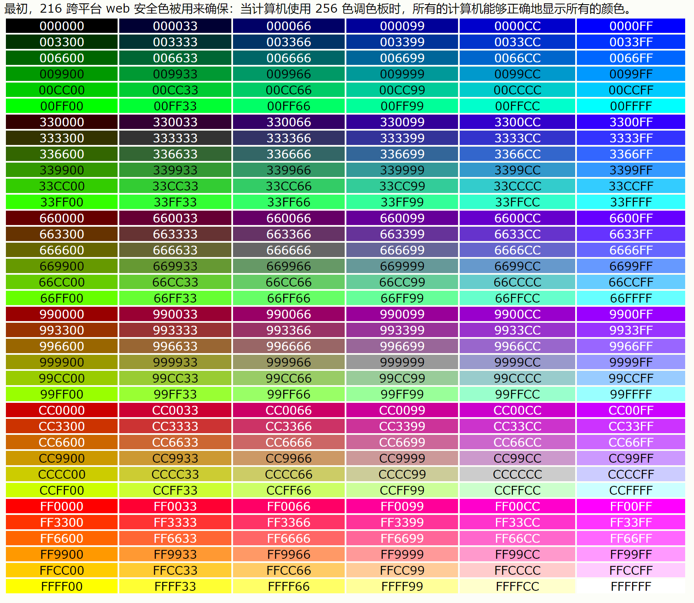

# CSS 层叠样式表

Cascading Style Sheets


[TOC]

## 总览

##### css样式

```css
h1 {                    /*选择器*/ 
    color: red;			/*样式*/
    font-size: 5em;
}
```
##### 外部样式表

```html
 <link rel="stylesheet" href="styles.css">
```
##### 内部样式表

```html
<head>
    <meta charset="utf-8">
    <title>My CSS experiment</title>
    <style>
      h1 {
        color: blue;
        background-color: yellow;
        border: 1px solid black;
      }

      p {
        color: red;
      }
    </style>
</head>
```


##### 注释

```css
// css注释：
/*这是单行注释*/
/*
    这是多行注释
    这是多行注释
*/
```

##### 元素

[如何构建CSS - 学习 Web 开发 | MDN (mozilla.org)](https://developer.mozilla.org/zh-CN/docs/Learn/CSS/First_steps/How_CSS_is_structured)

##### CSS究竟是怎么工作的？

当浏览器展示一个文件的时候，它必须兼顾文件的内容和文件的样式信息，下面我们会了解到它处理文件的标准的流程。需要知道的是，下面的步骤是浏览加载网页的简化版本，而且不同的浏览器在处理文件的时候会有不同的方式，但是下面的步骤基本都会出现。

1. 浏览器载入HTML文件（比如从网络上获取）。

2. 将HTML文件转化成一个DOM（Document Object Model），DOM是文件在计算机内存中的表现形式，下一节将更加详细的解释DOM。
3. 接下来，浏览器会拉取该HTML相关的大部分资源，比如嵌入到页面的图片、视频和CSS样式。JavaScript则会稍后进行处理。
4. 浏览器拉取到CSS之后会进行解析，根据选择器的不同类型（比如element、class、id等等）把他们分到不同的“桶”中。浏览器基于它找到的不同的选择器，将不同的规则（基于选择器的规则，如元素选择器、类选择器、id选择器等）应用在对应的DOM的节点中，并添加节点依赖的样式（这个中间步骤称为渲染树）。
5. 上述的规则应用于渲染树之后，渲染树会依照应该出现的结构进行布局。
6. 网页展示在屏幕上（这一步被称为着色）。

## 模块

#### 颜色

```css
/* 关键词 */
color: currentcolor;

/* <named-color>值 */
color: red;
color: orange;
color: tan;
color: rebeccapurple;

/* <hex-color>值 */
color: //090;
color: //009900;
color: //090a;
color: //009900aa;

/* <rgb()>值 */
color: rgb(34, 12, 64, 0.6);
color: rgba(34, 12, 64, 0.6);
color: rgb(34 12 64 / 0.6);
color: rgba(34 12 64 / 0.3);
color: rgb(34.0 12 64 / 60%);
color: rgba(34.6 12 64 / 30%);

/* <hsl(a)>值 */
/*Hue, Saturation, Lightness，(alpha)
色相 饱和度 亮度 透明度*/
color: hsl(30, 100%, 50%, 0.6);
color: hsla(30, 100%, 50%, 0.6);
color: hsl(30 100% 50% / 0.6);
color: hsla(30 100% 50% / 0.6);
color: hsl(30.0 100% 50% / 60%);
color: hsla(30.2 100% 50% / 60%);

/* 全局值 */
color: inherit;
color: initial;
color: unset;
```

##### web安全色



##### 颜色名

**aqua、black、blue、fuchsia、gray、green、lime、maroon、navy、olive、purple、red、silver、teal、white、yellow。**

#### 映射属性（逻辑属性）

这些属性用逻辑（**logical**）和相对变化（**flow relative**）代替了像宽`width`和高`height`一样的物理属性。

横向书写模式下，映射到`width`的属性被称作内联尺寸（[`inline-size`](https://developer.mozilla.org/zh-CN/docs/Web/CSS/inline-size)）——内联维度的尺寸。而映射`height`的属性被称为块级尺寸（[`block-size`](https://developer.mozilla.org/zh-CN/docs/Web/CSS/block-size)），这是块级维度的尺寸。


#### 边框

```css
border-bottom: 1px;
border-bottom: 2px dotted;
border-bottom: medium dashed blue;
```

```css
/* width */
/* Keyword values */
border-bottom-width: thin;
border-bottom-width: medium;
border-bottom-width: thick;

/* <length> values */
border-bottom-width: 10em;
border-bottom-width: 3vmax;
border-bottom-width: 6px;

/* Global keywords */
border-bottom-width: inherit;
border-bottom-width: initial;
border-bottom-width: unset;
```

```css
/*style*/
/* Keyword values */
border-bottom-style: none;
border-bottom-style: hidden;
border-bottom-style: dotted;
border-bottom-style: dashed;
border-bottom-style: solid;
border-bottom-style: double;
border-bottom-style: groove;
border-bottom-style: ridge;
border-bottom-style: inset;
border-bottom-style: outset;

/* Global values */
```

```css
/*color*/
border-bottom-color: yellow;
border-bottom-color: //F5F6F7;
```

```css
/*圆角*/
.box {
  border-radius: 10px;	- 圆角半径
  border-top-right-radius: 1em 10%;	 - 右上角水平半径为1em，垂直半径为10%
  
} 
```


#### 表格样式化

```css
/* spacing */

table {
  table-layout: fixed;
  width: 100%;
  border-collapse: collapse;
  border: 3px solid purple;
}

thead th:nth-child(1) {
  width: 30%;
}

thead th:nth-child(2) {
  width: 20%;
}

thead th:nth-child(3) {
  width: 15%;
}

thead th:nth-child(4) {
  width: 35%;
}

th, td {
  padding: 20px;
}

/*标题*/
caption {
  font-family: 'Rock Salt', cursive;
  padding: 20px;
  font-style: italic;
  caption-side: bottom;
  color: //666;
  text-align: right;
  letter-spacing: 1px;
}
```

##### 默认的样式预设值：

- `<ul><ol>`元素设置[`margin`](https://developer.mozilla.org/zh-CN/docs/Web/CSS/margin)的顶部和底部: 16px(1em) 0;和 padding-left: 40px(2.5em); （在这里注意的是浏览器默认字体大小为16px）。
- `<li>`默认是没有设置间距的。
- `<dl>`元素设置 margin的顶部和底部: 16px(1em) ，无内边距设定。
- `<dd>`元素设置为： [`margin-left`](https://developer.mozilla.org/zh-CN/docs/Web/CSS/margin-left) `40px` (`2.5em`)。
- 在参考中提到的`<p>`元素设置 margin的顶部和底部: 16px(1em)，和其他的列表类型相同。

##### 表格间距

```css
 line-height: 1.5;
```

##### 列表特定样式

现在我们来看一下列表的一般间距，我们来研究一些列表具有的特定属性。 我们从三个属性开始了解，这三个属性可以在`<ul>`,`<ol>`元素上设置：

- [`list-style-type`](https://developer.mozilla.org/zh-CN/docs/Web/CSS/list-style-type) ：设置用于列表的项目符号的类型，例如无序列表的方形或圆形项目符号，或有序列表的数字，字母或罗马数字。
- [`list-style-position`](https://developer.mozilla.org/zh-CN/docs/Web/CSS/list-style-position) ：设置在每个项目开始之前，项目符号是出现在列表项内，还是出现在其外。(outside inside)
- [`list-style-image`](https://developer.mozilla.org/zh-CN/docs/Web/CSS/list-style-image) ：允许您为项目符号使用自定义图片，而不是简单的方形或圆形。

##### 列表计数

`start`

`resersed`

`value`

#### 链接样式

##### 默认样式

- 链接具有下划线。
- 未访问过的 (Unvisited) 的链接是蓝色的。
- 访问过的 (Visited) 的链接是紫色的.
- 悬停 (Hover) 在一个链接的时候鼠标的光标会变成一个小手的图标。
- 选中 (Focus) 链接的时候，链接周围会有一个轮廓，你应该可以按 tab 来选中这个页面的链接。
- 激活 (Active) 链接的时候会变成红色 (当你点击链接时，请尝试按住鼠标按钮。)

##### 链接规则集

```css
body {
  width: 300px;
  margin: 0 auto;
  font-size: 1.2rem;
  font-family: sans-serif;
}

p {
  line-height: 1.4;
}

a {
  outline: none;
  text-decoration: none;
  padding: 2px 1px 0;
}

a:link {
  color: //265301;
}

a:visited {
  color: //437A16;
}

a:focus {
  border-bottom: 1px solid;
  background: //BAE498;
}

a:hover {
  border-bottom: 1px solid;
  background: //CDFEAA;
}

a:active {
  background: //265301;
  color: //CDFEAA;
}
```

#### 样式化为按钮⭐

```css
body,html {
  margin: 0;
  font-family: sans-serif;
}

ul {
  padding: 0;
  width: 100%;
}

li {
  display: inline;
}

a {
  outline: none;
  text-decoration: none;
  display: inline-block;
  width: 19.5%;
  margin-right: 0.625%;
  text-align: center;
  line-height: 3;
  color: black;
}

li:last-child a {
  margin-right: 0;
}

a:link, a:visited, a:focus {
  background: yellow;
}

a:hover {
  background: orange;
}

a:active {
  background: red;
  color: white;
}
```


### 文本

#### 字体指定

```css
/* 一个字体族名和一个通用字体族名 */
font-family: "Gill Sans Extrabold", sans-serif;
font-family: "Goudy Bookletter 1911", sans-serif;
/*无空格时可不加双引号*/

/* 仅有一个通用字体族名 */
font-family: serif;
font-family: sans-serif;
font-family: monospace;    //等宽
font-family: cursive;
font-family: fantasy;	//艺术字
font-family: system-ui;
font-family: emoji;
font-family: math;
font-family: fangsong;	//仿宋

/* 全局值 */
font-family: inherit;
font-family: initial;
font-family: unset;

```
##### 网页安全字体

|                 |            |                                                              |
| :-------------- | :--------: | :----------------------------------------------------------: |
| 字体名称        |    泛型    |                             注意                             |
| Arial           | sans-serif | 通常认为最佳做法还是添加 Helvetica 作为 Arial 的首选替代品，尽管它们的字体面几乎相同，但 Helvetica 被认为具有更好的形状，即使Arial更广泛地可用。 |
| Courier New     | monospace  | 某些操作系统有一个 Courier New 字体的替代（可能较旧的）版本叫Courier。 |
| Georgia         |   serif    |                                                              |
| Times New Roman |   serif    | 某些操作系统有一个 Times New Roman 字体的替代（可能较旧的）版本叫 Times。 |
| Trebuchet MS    | sans-serif |     您应该小心使用这种字体——它在移动操作系统上并不广泛。     |
| Verdana         | sans-serif |                                                              |

##### 五种CSS常用字体

| 名称             | 定义                                                         | 
| :----------- | :----------------------------------------------------------- |
| `serif`      | 有衬线的字体 （衬线一词是指字体笔画尾端的小装饰，存在于某些印刷体字体中） |
| `sans-serif` | 没有衬线的字体。                                             |
| `monospace`  | 每个字符具有相同宽度的字体，通常用于代码列表。               |
| `cursive`    | 用于模拟笔迹的字体，具有流动的连接笔画。                     |
| `fantasy`    | 用来装饰的字体                                              

#### web字体

font-face指定要下载的字体文件

```css
@font-face {
  font-family: "myFont";
  src: url("myFont.ttf");
}
```

##### 在线字体服务

 [Google Fonts](https://www.google.com/fonts)


#### 字体栈

```css
p {
  font-family: "Trebuchet MS", Verdana, sans-serif;
}
```


#### 字体粗细

```css
/* Keyword values */
font-weight: normal;	//400
font-weight: bold;		//700

/* Keyword values relative to the parent */
font-weight: lighter;	//比从父元素继承来的值更细
font-weight: bolder;

/* Numeric keyword values 
1-1000    四舍五入转化为100的整数倍*/
font-weight: 1
font-weight: 100;
font-weight: 100.6;
font-weight: 123;
~~~
font-weight: 1000;

/* Global values */
```

#### 字体大小

```css
/* <absolute-size>，绝对大小值 */
font-size: xx-small;
font-size: x-small;
font-size: small;
font-size: medium;
font-size: large;
font-size: x-large;
font-size: xx-large;

/* <relative-size>，相对大小值 */
font-size: larger;
font-size: smaller;

/* <length>，长度值 */
font-size: 12px;	//像素值
font-size: 0.8em;	//相对于继承属性的比例
/*em = 希望得到的像素大小 / 父元素字体像素大小*/

/* <percentage>，百分比值 */
font-size: 80%;

font-size: inherit;
```

#### 行高

```css
line-height: 1.5;
->字体高度的1.5倍
```

#### 字间距和单词间距

```css
p::first-line {
  letter-spacing: 2px;
  word-spacing: 4px;
}
```


#### 文字阴影

```css
text-shadow: 4px 4px 5px red;

/*多种阴影*/
text-shadow: -1px -1px 1px //aaa,
             0px 4px 1px rgba(0,0,0,0.5),
             4px 4px 5px rgba(0,0,0,0.7),
             0px 0px 7px rgba(0,0,0,0.4);
```

1. 阴影与原始文本的**水平偏移**，可以使用大多数的 CSS 单位 [length and size units](https://developer.mozilla.org/en-US/docs/Learn/CSS/Building_blocks/Values_and_units//length_and_size), 但是 px 是比较合适的。这个值必须指定。
2. 阴影与原始文本的垂直偏移;效果基本上就像水平偏移，除了它**向上/向下**移动阴影，而不是左/右。这个值必须指定。
3. **模糊半径** - 更高的值意味着阴影分散得更广泛。如果不包含此值，则默认为0，这意味着没有模糊。可以使用大多数的 CSS 单位 [length and size units](https://developer.mozilla.org/en-US/docs/Learn/CSS/Building_blocks/Values_and_units//length_and_size).
4. 阴影的**基础颜色**，可以使用大多数的 CSS 颜色单位 [CSS color unit](https://developer.mozilla.org/en-US/docs/Learn/CSS/Building_blocks/Values_and_units//colors). 如果没有指定，默认为 `black`.

#### 文本对齐

```css
text-align: left;
```

相对于BOX

- `left`: 左对齐文本。
- `right`: 右对齐文本。
- `center`: 居中文字
- `justify`: 使文本展开，改变单词之间的差距，使所有文本行的宽度相同。


#### 文本修饰text-decoration

```
text-decoration-line
文本修饰的位置,
如下划线underline，删除线line-through

text-decoration-color
文本修饰的颜色

text-decoration-style
文本修饰的样式
如波浪线wavy实线solid虚线dashed

text-decoration-thickness
文本修饰线的粗细
```

#### 不同方向的文本


```css
writing-mode: 

horizontal-tb: 块流向从上至下。对应的文本方向是横向的。(默认）)
vertical-rl: 块流向从右向左。对应的文本方向是纵向的。
vertical-lr: 块流向从左向右。对应的文本方向是纵向的。

```

- **块**维度指的总是块在页面书写模式下的**显示**方向。

- **内联**维度指的总是**文本**方向。


#### 其他样式

##### Font 样式:

- [`font-variant`](https://developer.mozilla.org/zh-CN/docs/Web/CSS/font-variant): 在小型大写字母和普通文本选项之间切换。
- [`font-kerning`](https://developer.mozilla.org/zh-CN/docs/Web/CSS/font-kerning): 开启或关闭字体间距选项。
- [`font-feature-settings`](https://developer.mozilla.org/zh-CN/docs/Web/CSS/font-feature-settings): 开启或关闭不同的 [OpenType](https://en.wikipedia.org/wiki/OpenType) 字体特性。
- [`font-variant-alternates`](https://developer.mozilla.org/zh-CN/docs/Web/CSS/font-variant-alternates): 控制给定的自定义字体的替代字形的使用。
- [`font-variant-caps`](https://developer.mozilla.org/zh-CN/docs/Web/CSS/font-variant-caps): 控制大写字母替代字形的使用。
- [`font-variant-east-asian` (en-US)](https://developer.mozilla.org/en-US/docs/Web/CSS/font-variant-east-asian): 控制东亚文字替代字形的使用, 像日语和汉语。
- [`font-variant-ligatures`](https://developer.mozilla.org/zh-CN/docs/Web/CSS/font-variant-ligatures): 控制文本中使用的连写和上下文形式。
- [`font-variant-numeric`](https://developer.mozilla.org/zh-CN/docs/Web/CSS/font-variant-numeric): 控制数字，分式和序标的替代字形的使用。
- [`font-variant-position`](https://developer.mozilla.org/zh-CN/docs/Web/CSS/font-variant-position): 控制位于上标或下标处，字号更小的替代字形的使用。
- [`font-size-adjust`](https://developer.mozilla.org/zh-CN/docs/Web/CSS/font-size-adjust): 独立于字体的实际大小尺寸，调整其可视大小尺寸。
- [`font-stretch`](https://developer.mozilla.org/zh-CN/docs/Web/CSS/font-stretch): 在给定字体的可选拉伸版本中切换。
- [`text-underline-position`](https://developer.mozilla.org/zh-CN/docs/Web/CSS/text-underline-position): 指定下划线的排版位置，通过使用 `text-decoration-line` 属性的`underline` 值。
- [`text-rendering`](https://developer.mozilla.org/zh-CN/docs/Web/CSS/text-rendering): 尝试执行一些文本渲染优化。

##### 文本布局样式：

- [`text-indent`](https://developer.mozilla.org/zh-CN/docs/Web/CSS/text-indent): 指定文本内容的第一行前面应该留出多少的水平空间。
- [`text-overflow`](https://developer.mozilla.org/zh-CN/docs/Web/CSS/text-overflow): 定义如何向用户表示存在被隐藏的溢出内容。
- [`white-space`](https://developer.mozilla.org/zh-CN/docs/Web/CSS/white-space): 定义如何处理元素内部的空白和换行。
- [`word-break`](https://developer.mozilla.org/zh-CN/docs/Web/CSS/word-break): 指定是否能在单词内部换行。
- [`direction`](https://developer.mozilla.org/zh-CN/docs/Web/CSS/direction): 定义文本的方向 (这取决于语言，并且通常最好让HTML来处理这部分，因为它是和文本内容相关联的。)
- [`hyphens`](https://developer.mozilla.org/zh-CN/docs/Web/CSS/hyphens): 为支持的语言开启或关闭连字符。
- [`line-break`](https://developer.mozilla.org/zh-CN/docs/Web/CSS/line-break): 对东亚语言采用更强或更弱的换行规则。
- [`text-align-last`](https://developer.mozilla.org/zh-CN/docs/Web/CSS/text-align-last): 定义一个块或行的最后一行，恰好位于一个强制换行前时，如何对齐。
- [`text-orientation`](https://developer.mozilla.org/zh-CN/docs/Web/CSS/text-orientation): 定义行内文本的方向。
- [`word-wrap`](https://developer.mozilla.org/zh-CN/docs/Web/CSS/overflow-wrap): 指定浏览器是否可以在单词内换行以避免超出范围。
- [`writing-mode`](https://developer.mozilla.org/zh-CN/docs/Web/CSS/writing-mode): 定义文本行布局为水平还是垂直，以及后继文本流的方向。


## 构建

### 层叠 优先级 继承

#### 冲突规则

- 相同优先级的规则，顺序在最后的生效

- 优先级不同，优先级高的生效

​		*类选择* > *元素选择*

#### /* Global keywords */

`inherit`
设置该属性会使子元素属性和**父元素**相同。实际上，就是 "开启继承".
`initial`
设置属性值和浏览器**默认样式**相同。如果浏览器默认样式中未设置且该属性是自然继承的，那么会设置为 inherit 。
`unset`
将属性重置为**自然值**，也就是如果属性是自然继承那么就是 inherit，否则和 initial一样

#### 重设所有属性值

CSS 的 shorthand 属性 **all** 可以用于同时将这些继承值中的一个应用于（几乎）所有属性。它的值可以是其中任意一个(inherit, initial, unset, or revert)。这是一种撤销对样式所做更改的简便方法，以便回到之前已知的起点。

```css
.fix-this {
    all: unset;
}
```

#### 优先级计算

一个选择器的优先级可以说是由四个部分相加 (分量)，可以认为是个十百千 — 四位数的四个位数：

1. **千位**： 如果声明在 **style的属性**（内联样式）则该位得一分。这样的声明没有选择器，所以它得分总是1000。
2. **百位**： 选择器中包含**ID**选择器则该位得一分。
3. **十位**： 选择器中包含**类**选择器、**属性**选择器或者**伪类**则该位得一分。
4. **个位**：选择器中包含**元素、伪元素**选择器则该位得一分。
5. 不允许进行进位
6. `!important`可以用来覆盖所有上面所有优先级计算，用于修改特定属性的值， 能够覆盖普通规则的层叠。

### 选择器

#### 类型、类和ID选择器

```css
指向了所有HTML元素<h1>。
h1 { }

class的选择器：
.box { }
选择文档中应用了这个类的所有物件

id选择器：
//unique { }
以//开头

全局选择器
article *:first-child {
} 
```

#### 标签属性选择器

```css
a[title] { }

// 根据一个有特定值的标签属性是否存在来选择：
a[href="https://example.com"] { }


// 一个或多个属性中至少有一个和VALUE匹配
p[class~="special"]

// 值正为value，或者开始为value，后面紧随着一个连字符。
div[lang|="zh"]

// 其值开头为value子字符串
li[class^="box-"]

// 值结尾为value子字符串
li[class$="-box"]

// 至少出现了一次value子字符串
li[class*="box"]

// 大小写不敏感 在]之前写一个 i
li[class^="a" i] {
    color: red;
}
```

#### 伪类与伪元素选择器

这组选择器包含了伪类，用来样式化一个元素的特定状态。

```css
/*例如`:hover`伪类会在鼠标指针悬浮到一个元素上的时候选择这个元素：*/
a:hover { }

/*它还可以包含了伪元素，选择一个元素的某个部分而不是元素自己。例如，::first-line是会选择一个元素（下面的情况中是<p>）中的第一行，类似<span>包在了第一个被格式化的行外面，然后选择这个<span>。*/
p::first-line { }

/*伪类是开头为冒号的关键字*/
p:first-child
p:last-child
p:only-child	// 没有任何兄弟元素的元素
p:invalid	// 表示任意内容未通过验证的<input> 或其他 <form> 元素
```

##### [伪类](https://developer.mozilla.org/zh-CN/docs/Learn/CSS/Building_blocks/Selectors/Pseudo-classes_and_pseudo-elements//伪类)

| 选择器                                                       | 描述                                                         |
| :----------------------------------------------------------- | :----------------------------------------------------------- |
| [`:active`](https://developer.mozilla.org/zh-CN/docs/Web/CSS/:active) | 在用户激活（例如点击）元素的时候匹配。                       |
| [`:any-link`](https://developer.mozilla.org/zh-CN/docs/Web/CSS/:any-link) | 匹配一个链接的`:link`和`:visited`状态。                      |
| [`:blank`](https://developer.mozilla.org/zh-CN/docs/Web/CSS/:blank) | 匹配空输入值的[``元素](https://developer.mozilla.org/en-US/docs/Web/HTML/Element/input)。 |
| [`:checked`](https://developer.mozilla.org/zh-CN/docs/Web/CSS/:checked) | 匹配处于选中状态的单选或者复选框。                           |
| [`:current` (en-US)](https://developer.mozilla.org/en-US/docs/Web/API/WebVTT_API) | 匹配正在展示的元素，或者其上级元素。                         |
| [`:default`](https://developer.mozilla.org/zh-CN/docs/Web/CSS/:default) | 匹配一组相似的元素中默认的一个或者更多的UI元素。             |
| [`:dir`](https://developer.mozilla.org/zh-CN/docs/Web/CSS/:dir) | 基于其方向性（HTML`dir`属性或者CSS`direction`属性的值）匹配一个元素。 |
| [`:disabled`](https://developer.mozilla.org/zh-CN/docs/Web/CSS/:disabled) | 匹配处于关闭状态的用户界面元素                               |
| [`:empty`](https://developer.mozilla.org/zh-CN/docs/Web/CSS/:empty) | 匹配除了可能存在的空格外，没有子元素的元素。                 |
| [`:enabled`](https://developer.mozilla.org/zh-CN/docs/Web/CSS/:enabled) | 匹配处于开启状态的用户界面元素。                             |
| [`:first`](https://developer.mozilla.org/zh-CN/docs/Web/CSS/:first) | 匹配[分页媒体](https://developer.mozilla.org/en-US/docs/Web/CSS/Paged_Media)的第一页。 |
| [`:first-child`](https://developer.mozilla.org/zh-CN/docs/Web/CSS/:first-child) | 匹配兄弟元素中的第一个元素。                                 |
| [`:first-of-type`](https://developer.mozilla.org/zh-CN/docs/Web/CSS/:first-of-type) | 匹配兄弟元素中第一个某种类型的元素。                         |
| [`:focus`](https://developer.mozilla.org/zh-CN/docs/Web/CSS/:focus) | 当一个元素有焦点的时候匹配。                                 |
| [`:focus-visible`](https://developer.mozilla.org/zh-CN/docs/Web/CSS/:focus-visible) | 当元素有焦点，且焦点对用户可见的时候匹配。                   |
| [`:focus-within`](https://developer.mozilla.org/zh-CN/docs/Web/CSS/:focus-within) | 匹配有焦点的元素，以及子代元素有焦点的元素。                 |
| [`:future` (en-US)](https://developer.mozilla.org/en-US/docs/Web/CSS/:future) | 匹配当前元素之后的元素。                                     |
| [`:hover`](https://developer.mozilla.org/zh-CN/docs/Web/CSS/:hover) | 当用户悬浮到一个元素之上的时候匹配。                         |
| [`:indeterminate`](https://developer.mozilla.org/zh-CN/docs/Web/CSS/:indeterminate) | 匹配未定态值的UI元素，通常为[复选框](https://developer.mozilla.org/en-US/docs/Web/HTML/Element/input/checkbox)。 |
| [`:in-range`](https://developer.mozilla.org/zh-CN/docs/Web/CSS/:in-range) | 用一个区间匹配元素，当值处于区间之内时匹配。                 |
| [`:invalid`](https://developer.mozilla.org/zh-CN/docs/Web/CSS/:invalid) | 匹配诸如`<input>`的位于不可用状态的元素。                    |
| [`:lang`](https://developer.mozilla.org/zh-CN/docs/Web/CSS/:lang) | 基于语言（HTML[lang](https://developer.mozilla.org/zh-CN/docs/Web/HTML/Global_attributes/lang)属性的值）匹配元素。 |
| [`:last-child`](https://developer.mozilla.org/zh-CN/docs/Web/CSS/:last-child) | 匹配兄弟元素中最末的那个元素。                               |
| [`:last-of-type`](https://developer.mozilla.org/zh-CN/docs/Web/CSS/:last-of-type) | 匹配兄弟元素中最后一个某种类型的元素。                       |
| [`:left`](https://developer.mozilla.org/zh-CN/docs/Web/CSS/:left) | 在[分页媒体 (en-US)](https://developer.mozilla.org/en-US/docs/Web/CSS/CSS_Pages)中，匹配左手边的页。 |
| [`:link`](https://developer.mozilla.org/zh-CN/docs/Web/CSS/:link) | 匹配未曾访问的链接。                                         |
| [`:local-link` (en-US)](https://developer.mozilla.org/en-US/docs/Web/CSS/:local-link) | 匹配指向和当前文档同一网站页面的链接。                       |
| [`:is()`](https://developer.mozilla.org/zh-CN/docs/Web/CSS/:is) | 匹配传入的选择器列表中的任何选择器。                         |
| [`:not`](https://developer.mozilla.org/zh-CN/docs/Web/CSS/:not) | 匹配作为值传入自身的选择器未匹配的物件。                     |
| [`:nth-child`](https://developer.mozilla.org/zh-CN/docs/Web/CSS/:nth-child) | 匹配一列兄弟元素中的元素——兄弟元素按照an+b形式的式子进行匹配（比如2n+1匹配元素1、3、5、7等。即所有的奇数个）。 |
| [`:nth-of-type`](https://developer.mozilla.org/zh-CN/docs/Web/CSS/:nth-of-type) | 匹配某种类型的一列兄弟元素（比如，`<p>`元素）——兄弟元素按照an+b形式的式子进行匹配（比如2n+1匹配元素1、3、5、7等。即所有的奇数个）。 |
| [`:nth-last-child`](https://developer.mozilla.org/zh-CN/docs/Web/CSS/:nth-last-child) | 匹配一列兄弟元素，从后往前倒数。兄弟元素按照an+b形式的式子进行匹配（比如2n+1匹配按照顺序来的最后一个元素，然后往前两个，再往前两个，诸如此类。从后往前数的所有奇数个）。 |
| [`:nth-last-of-type`](https://developer.mozilla.org/zh-CN/docs/Web/CSS/:nth-last-of-type) | 匹配某种类型的一列兄弟元素（比如，`<p>`元素），从后往前倒数。兄弟元素按照an+b形式的式子进行匹配（比如2n+1匹配按照顺序来的最后一个元素，然后往前两个，再往前两个，诸如此类。从后往前数的所有奇数个）。 |
| [`:only-child`](https://developer.mozilla.org/zh-CN/docs/Web/CSS/:only-child) | 匹配没有兄弟元素的元素。                                     |
| [`:only-of-type`](https://developer.mozilla.org/zh-CN/docs/Web/CSS/:only-of-type) | 匹配兄弟元素中某类型仅有的元素。                             |
| [`:optional`](https://developer.mozilla.org/zh-CN/docs/Web/CSS/:optional) | 匹配不是必填的form元素。                                     |
| [`:out-of-range`](https://developer.mozilla.org/zh-CN/docs/Web/CSS/:out-of-range) | 按区间匹配元素，当值不在区间内的的时候匹配。                 |
| [`:past` (en-US)](https://developer.mozilla.org/en-US/docs/Web/CSS/:past) | 匹配当前元素之前的元素。                                     |
| [`:placeholder-shown`](https://developer.mozilla.org/zh-CN/docs/Web/CSS/:placeholder-shown) | 匹配显示占位文字的input元素。                                |
| [`:playing` (en-US)](https://developer.mozilla.org/en-US/docs/Web/CSS/:playing) | 匹配代表音频、视频或者相似的能“播放”或者“暂停”的资源的，且正在“播放”的元素。 |
| [`:paused` (en-US)](https://developer.mozilla.org/en-US/docs/Web/CSS/:paused) | 匹配代表音频、视频或者相似的能“播放”或者“暂停”的资源的，且正在“暂停”的元素。 |
| [`:read-only`](https://developer.mozilla.org/zh-CN/docs/Web/CSS/:read-only) | 匹配用户不可更改的元素。                                     |
| [`:read-write`](https://developer.mozilla.org/zh-CN/docs/Web/CSS/:read-write) | 匹配用户可更改的元素。                                       |
| [`:required`](https://developer.mozilla.org/zh-CN/docs/Web/CSS/:required) | 匹配必填的form元素。                                         |
| [`:right`](https://developer.mozilla.org/zh-CN/docs/Web/CSS/:right) | 在[分页媒体 (en-US)](https://developer.mozilla.org/en-US/docs/Web/CSS/CSS_Pages)中，匹配右手边的页。 |
| [`:root`](https://developer.mozilla.org/zh-CN/docs/Web/CSS/:root) | 匹配文档的根元素。                                           |
| [`:scope`](https://developer.mozilla.org/zh-CN/docs/Web/CSS/:scope) | 匹配任何为参考点元素的的元素。                               |
| [`:valid`](https://developer.mozilla.org/zh-CN/docs/Web/CSS/:valid) | 匹配诸如`<input>`元素的处于可用状态的元素。                  |
| [`:target`](https://developer.mozilla.org/zh-CN/docs/Web/CSS/:target) | 匹配当前URL目标的元素（例如如果它有一个匹配当前[URL分段](https://en.wikipedia.org/wiki/Fragment_identifier)的元素）。 |
| [`:visited`](https://developer.mozilla.org/zh-CN/docs/Web/CSS/:visited) | 匹配已访问链接。                                             |

##### [伪元素](https://developer.mozilla.org/zh-CN/docs/Learn/CSS/Building_blocks/Selectors/Pseudo-classes_and_pseudo-elements//伪元素)

| 选择器                                                       | 描述                                                 |
| :----------------------------------------------------------- | :--------------------------------------------------- |
| [`::after`](https://developer.mozilla.org/zh-CN/docs/Web/CSS/::after) | 匹配出现在原有元素的实际内容之后的一个可样式化元素。 |
| [`::before`](https://developer.mozilla.org/zh-CN/docs/Web/CSS/::before) | 匹配出现在原有元素的实际内容之前的一个可样式化元素。 |
| [`::first-letter`](https://developer.mozilla.org/zh-CN/docs/Web/CSS/::first-letter) | 匹配元素的第一个字母。                               |
| [`::first-line`](https://developer.mozilla.org/zh-CN/docs/Web/CSS/::first-line) | 匹配包含此伪元素的元素的第一行。                     |
| [`::grammar-error`](https://developer.mozilla.org/zh-CN/docs/Web/CSS/::grammar-error) | 匹配文档中包含了浏览器标记的语法错误的那部分。       |
| [`::selection`](https://developer.mozilla.org/zh-CN/docs/Web/CSS/::selection) | 匹配文档中被选择的那部分。                           |
| [`::spelling-error`](https://developer.mozilla.org/zh-CN/docs/Web/CSS/::spelling-error) | 匹配文档中包含了浏览器标记的拼写错误的那部分。       |


#### 关系选择器

##### 后代选择器

典型用单个空格（` `）字符——组合两个选择器，比如，第二个选择器匹配的元素被选择，如果他们有一个祖先（父亲，父亲的父亲，父亲的父亲的父亲，等等）元素匹配第一个选择器

##### 子代关系选择器

大于号（`>`），只会在选择器选中直接子元素的时候匹配。继承关系上更远的后代则不会匹配。例如，只选中作为`<article>`的直接子元素的`<p>`元素：

`article > p`

##### 邻接兄弟选择器

（`+`）用来选中恰好处于另一个在继承关系上同级的元素旁边的物件。例如，选中所有紧随`<p>`元素之后的``元素：

```css
p + img
```

##### 通用兄弟

如果你想选中一个元素的兄弟元素，即使它们不直接相邻，你还是可以使用通用兄弟关系选择器（`~`）。要选中所有的`<p>`元素后*任何地方*的``元素，我们会这样做：

```css
p ~ img
```


### CSS的值与单位

#### [数字，长度和百分比](https://developer.mozilla.org/zh-CN/docs/Learn/CSS/Building_blocks/Values_and_units//数字，长度和百分比)

您可能会发现自己在CSS中使用了各种数值数据类型。 以下全部归类为数值：

| 数值类型       | 描述                                                         |
| :------------- | :----------------------------------------------------------- |
| `<integer>`    | `<integer>`是一个整数，比如1024或-55。                       |
| `<number>`     | `<number>`表示一个小数——它可能有小数点后面的部分，也可能没有，例如0.255、128或-1.2。 |
| `<dimension>`  | `<dimension>`是一个`<number>`，它有一个附加的单位，例如45deg、5s或10px。`<dimension>`是一个伞形类别，包括`<length>`、`<angle>`、`<time>`和`<resolution>`类型。 |
| `<percentage>` | `<percentage>`表示一些其他值的一部分，例如50%。百分比值总是相对于另一个量，例如，一个元素的长度相对于其父元素的长度。 |

##### [长度](https://developer.mozilla.org/zh-CN/docs/Learn/CSS/Building_blocks/Values_and_units//长度)

最常见的数字类型是`<length>`，例如10px(像素)或30em。CSS中有两种类型的长度——相对长度和绝对长度。重要的是要知道它们之间的区别，以便理解他们控制的元素将变得有多大。

##### 绝对长度单位

以下都是**绝对**长度单位——它们与其他任何东西都没有关系，通常被认为总是相同的大小。

| 单位 | 名称         | 等价换算            |
| :--- | :----------- | :------------------ |
| `cm` | 厘米         | 1cm = 96px/2.54     |
| `mm` | 毫米         | 1mm = 1/10th of 1cm |
| `Q`  | 四分之一毫米 | 1Q = 1/40th of 1cm  |
| `in` | 英寸         | 1in = 2.54cm = 96px |
| `pc` | 十二点活字   | 1pc = 1/6th of 1in  |
| `pt` | 点           | 1pt = 1/72th of 1in |
| `px` | 像素         | 1px = 1/96th of 1in |

这些值中的大多数在用于打印时比用于屏幕输出时更有用。例如，我们通常不会在屏幕上使用cm。惟一一个您经常使用的值，估计就是px(像素)。

##### 相对长度单位

相对长度单位相对于其他一些东西，比如父元素的字体大小，或者视图端口的大小。使用相对单位的好处是，经过一些仔细的规划，您可以使文本或其他元素的大小与页面上的其他内容相对应。下表列出了web开发中一些最有用的单位。

| 单位   | 相对于                                                       |
| :----- | :----------------------------------------------------------- |
| `em`   | 在 font-size 中使用是相对于父元素的字体大小，在其他属性中使用是相对于自身的字体大小，如 width |
| `ex`   | 字符“x”的高度                                                |
| `ch`   | 数字“0”的宽度                                                |
| `rem`  | 根元素的字体大小                                             |
| `lh`   | 元素的line-height                                            |
| `vw`   | 视窗宽度的1%                                                 |
| `vh`   | 视窗高度的1%                                                 |
| `vmin` | 视窗较小尺寸的1%                                             |
| `vmax` | 视图大尺寸的1%                                               |


### [位置](https://developer.mozilla.org/zh-CN/docs/Learn/CSS/Building_blocks/Values_and_units//位置)

`<position>` 数据类型表示一组2D坐标，用于定位一个元素，如背景图像(通过 `background-position`)。它可以使用关键字(如 `top`, `left`, `bottom`, `right`, 以及`center` )将元素与2D框的特定边界对齐，以及表示框的顶部和左侧边缘偏移量的长度。

一个典型的位置值由两个值组成——第一个值水平地设置位置，第二个值垂直地设置位置。如果只指定一个轴的值，另一个轴将**默认为 `center`。**

### 函数

##### calc()

例：`calc()`使框宽为20% + 100px。20%是根据父容器.wrapper的宽度来计算的，因此如果宽度改变，它也会改变。我们不能事先做这个计算，因为我们不知道父类的20%是多少，所以我们使用`calc()`来告诉浏览器为我们做这个计算。

```css
.box {
  width: calc(20% + 100px);
}
```


## 盒模型

#### 块级盒子（Block box）

一个被定义成块级的（block）盒子会表现出以下行为:

- 盒子会在内联的方向上扩展并占据父容器在该方向上的所有可用空间，在绝大数情况下意味着盒子会和父容器一样宽
- 每个盒子都会换行
- [`width`](https://developer.mozilla.org/zh-CN/docs/Web/CSS/width) 和 [`height`](https://developer.mozilla.org/zh-CN/docs/Web/CSS/height) 属性可以发挥作用
- 内边距（padding）, 外边距（margin） 和 边框（border） 会将其他元素从当前盒子周围“推开”

除非特殊指定，诸如标题(`<h1>`等)和段落(`<p>`)默认情况下都是块级的盒子。

---

#### 内联盒子（Inline box）

如果一个盒子对外显示为 `inline`，那么他的行为如下:

- 盒子不会产生换行。
-  [`width`](https://developer.mozilla.org/zh-CN/docs/Web/CSS/width) 和 [`height`](https://developer.mozilla.org/zh-CN/docs/Web/CSS/height) 属性将不起作用。
- 垂直方向的内边距、外边距以及边框会被应用但是不会把其他处于 `inline` 状态的盒子推开。
- 水平方向的内边距、外边距以及边框会被应用且会把其他处于 `inline` 状态的盒子推开。

用做链接的 `<a>` 元素、 `<span>`、 `<em>` 以及 `<strong>` 都是默认处于 `inline` 状态的。


我们通过对盒子[`display`](https://developer.mozilla.org/zh-CN/docs/Web/CSS/display) 属性的设置，比如 `inline` 或者 `block` ，来控制盒子的外部显示类型。

---

##### display:inline-block

不希望一个项切换到新行，但希望它可以设定宽度和高度，并避免上面看到的重叠。

margin border padding


#### 溢出

```css
overflow:
visible;	- 溢出
hidden;		- 隐藏
scroll;		- 溢出时添加滚动条

overflow-y: scroll; - 仅y轴方向滚动
overflow: auto; - 自动检测
```


#### 断行work-break

```
normal
```

使用默认的断行规则。

```
break-all
```

对于non-CJK (CJK 指中文/日文/韩文) 文本，可在任意字符间断行。

```
keep-all
```

CJK 文本不断行。 Non-CJK 文本表现同 `normal`。

````
break-word
````

效果是`word-break: normal` 和 `overflow-wrap: anywhere` 的合，不论 [`overflow-wrap`](https://developer.mozilla.org/zh-CN/docs/Web/CSS/overflow-wrap)的值是多少。

#### overflow-wrap

当一个不能被分开的字符串太长而不能填充其包裹盒时，为防止其溢出，浏览器是否允许这样的单词中断换行。

```
normal
```

行只能在正常的单词断点处中断。（例如两个单词之间的空格）。

```
break-word
```

表示如果行内没有多余的地方容纳该单词到结尾，则那些正常的不能被分割的单词会被强制分割换行。


## 背景

#### 背景图片和颜色
```css
/**/
.a {
  background-image: url(star.png);
    /*图片
    使用逗号分隔可以有多个背景图像如下*/
  background-image: url(image1.png), url(image2.png), url(image3.png), url(image1.png);
  background-repeat: no-repeat, repeat-x, repeat;
  background-position: 10px 20px,  top right;
    
    
  background-color: blue;
	/*颜色*/
    
    
  background-image: linear-gradient(105deg, rgba(0,249,255,1) 39%, rgba(51,56,57,1) 96%);
    /*渐变代码*/    
}
```
##### [CSS渐变生成器](https://cssgradient.io/)


#### 平铺行为 

```css
/*background-repeat:*/
no-repeat — 不重复。
repeat-x —水平重复。
repeat-y —垂直重复。
repeat — 在两个方向重复。
```
#### 调整背景图像的大小

```css
/*background-size:
相同宽高比缩放*/
cover  - 铺满容器，多余部分被截掉 
contain - 缩放到图片能完全显示出来，可能有留白
```

#### 背景图像定位

```css
/*background-position:*/

// top和right这样的关键字:
.box {
  background-image: url(star.png);
  background-repeat: no-repeat;
  background-position: top center;
} 


// 或者使用 长度值, and 百分比：
.box {
  background-image: url(star.png);
  background-repeat: no-repeat;
  background-position: 20px 10%;
} 


// 你也可以混合使用关键字，长度值以及百分比，例如：

.box {
  background-image: url(star.png);
  background-repeat: no-repeat;
  background-position: top 20px;
}


// 最后，您还可以使用4-value语法来指示到盒子的某些边的距离——在本例中，长度单位是与其前面的值的偏移量。所以在下面的CSS中，我们将背景从顶部调整20px，从右侧调整10px:
.box {
  background-image: url(star.png);
  background-repeat: no-repeat;
  background-position: top 20px right 10px;
} 
```

#### 背景附加属性-滚动

指定他们如何滚动时，内容滚动。这是由[`background-attachment`](https://developer.mozilla.org/zh-CN/docs/Web/CSS/background-attachment)属性控制的，它可以接受以下值:

- `scroll`: 使元素的背景在页面滚动时滚动。如果滚动了元素内容，则背景不会移动。实际上，背景被固定在页面的相同位置，所以它会随着页面的滚动而滚动。
- `fixed`: 使元素的背景固定在视图端口上，这样当页面或元素内容滚动时，它就不会滚动。它将始终保持在屏幕上相同的位置。
- `local`: 这个值是后来添加的(它只在Internet Explorer 9+中受支持，而其他的在IE4+中受支持)，因为滚动值相当混乱，在很多情况下并不能真正实现您想要的功能。局部值将背景固定在设置的元素上，因此当您滚动元素时，背景也随之滚动。

​		[效果展示网页](https://mdn.github.io/learning-area/css/styling-boxes/backgrounds/background-attachment.html)


## 排版布局

默认

#### 弹性盒子

```css
section {
  display:flex
}

article {
  flex-direction: row;/*默认弹性方向*/
  flex-wrap: wrap;  /*换行*/
  flex: 200px;		/*最小宽度*/
  flex: 1;   		/*动态尺寸占比*/
}
```


##### 对齐

```css
div {
  display: flex;
  align-items: center;
  justify-content: space-around;
}
```

[`align-items`](https://developer.mozilla.org/zh-CN/docs/Web/CSS/align-items) 控制 flex 项在交叉轴上的位置。

- 默认的值是 `stretch`，其会使所有 flex 项沿着交叉轴的方向拉伸以填充父容器。如果父容器在交叉轴方向上没有固定宽度（即高度），则所有 flex 项将变得与最长的 flex 项一样长（即高度保持一致）。我们的第一个例子在默认情况下得到相等的高度的列的原因。
- 在上面规则中我们使用的 `center` 值会使这些项保持其原有的高度，但是会在交叉轴居中。这就是那些按钮垂直居中的原因。
- 你也可以设置诸如 `flex-start` 或 `flex-end` 这样使 flex 项在交叉轴的开始或结束处对齐所有的值。查看 [`align-items`](https://developer.mozilla.org/zh-CN/docs/Web/CSS/align-items) 了解更多。

[`justify-content`](https://developer.mozilla.org/zh-CN/docs/Web/CSS/justify-content) 控制 flex 项在主轴上的位置。

- 默认值是 `flex-start`，这会使所有 flex 项都位于主轴的开始处。
- 你也可以用 `flex-end` 来让 flex 项到结尾处。
- `center` 在 `justify-content` 里也是可用的，可以让 flex 项在主轴居中。
- 而我们上面用到的值 `space-around` 是很有用的——它会使所有 flex 项沿着主轴均匀地分布，在任意一端都会留有一点空间。
- 还有一个值是 `space-between`，它和 `space-around` 非常相似，只是它不会在两端留下任何空间。

##### 再排序

不影响DOM

```CSS
button:first-child {
  order: 1;
}
```

- 所有 flex 项默认的 [`order`](https://developer.mozilla.org/zh-CN/docs/Web/CSS/order) 值是 0。
- order 值大的 flex 项比 order 值小的在显示顺序中更靠后。
- 相同 order 值的 flex 项按源顺序显示。所以假如你有四个元素，其 order 值分别是2，1，1和0，那么它们的显示顺序就分别是第四，第二，第三，和第一。
- 第三个元素显示在第二个后面是因为它们的 order 值一样，且第三个元素在源顺序中排在第二个后面。

#### 网格

网格是由一系列水平及垂直的线构成的一种布局模式。

一个网格通常具有许多的**列（column）**与**行（row）**，以及行与行、列与列之间的间隙，这个间隙一般被称为**沟槽（gutter）**。

```css
.container {
  display: grid;
  grid-template-columns: 200px 200px 200px;
    
  grid-template-columns: repeat(3, 1fr);	/*重复构建*/
  grid-gap: 20px;
}
```

##### 隐式网格-行

格局内容自动创建，auto 自动调整

```css
.container {
  display: grid;
  grid-template-columns: repeat(3, 1fr);
  grid-auto-rows: 100px;
  grid-gap: 20px;
}
```

##### [`minmax`](https://developer.mozilla.org/zh-CN/docs/Web/CSS/minmax) 函数

为一个行/列的尺寸设置了取值范围。比如设定为 **`minmax(100px, auto)`**，那么尺寸就至少为100像素，并且如果内容尺寸大于100像素则会根据内容自动调整。

##### autofill

自动填满容器

```css
.container {
  display: grid;
  grid-template-columns: repeat(auto-fill, minmax(200px, 1fr));
  grid-auto-rows: minmax(100px, auto);
  grid-gap: 20px;
}
```

##### 基于线

定义网格之后

开始/结束

```css
header {
  grid-column: 1 / 3;
  grid-row: 1;
}

article {
  grid-column: 2;
  grid-row: 2;
}

aside {
  grid-column: 1;
  grid-row: 2;
}

footer {
  grid-column: 1 / 3;
  grid-row: 3;
}
```


##### grid-template-areas

```css
.container {
  display: grid;
  grid-template-areas:
      "header header"
      "sidebar content"
      "footer footer";
  grid-template-columns: 1fr 3fr;
  grid-gap: 20px;
}

header {
  grid-area: header;
}

article {
  grid-area: content;
}

aside {
  grid-area: sidebar;
}

footer {
  grid-area: footer;
}
```

#### 浮动布局

##### 流体布局

# ……未完待续


## OOCSS

Object Oriented CSS

建立一个叫作`media`的排布，里面包含所有的两种排布所共有的CSS——一个大致用于媒体对象的形状之类的基础类。然后我们再额外加入一个类，处理那些微小的区别，这样特定地扩展基础样式。

```css
.media {
  display: grid;
  grid-template-columns: 1fr 3fr;
}

.media .content {
  font-size: .8rem;
}
……
```

#### BEM

BEM即为块级元素修饰字符（Block Element Modifier）。在BEM中，一个块，例如一个按钮、菜单或者标志，就是独立的实体。一个元素就像一个列表项或者标题一样，被绑定到它所在的块。修饰字符是标记到一个块或者元素的标识，能够改变样式或者行为。你能认出使用BEM的代码，因为代码中在CSS的类里使用了多余的一个下划线和连字符。

增加的类和应用到OOCSS例子里面的相似，但是它们遵守了BEM严格的命名常规。


## 后处理以进行优化

如果你对加入例如许多额外的注释和空格，增大你的样式表大小有所关心的话，那么后处理会通过在生产版本中略去任何不必要的东西的方式，优化CSS。后处理解决方案中，通过这种方式实现的一个例子是[cssnano](https://cssnano.co/)。

- ### [CSS Validator](https://jigsaw.w3.org/css-validator/)

