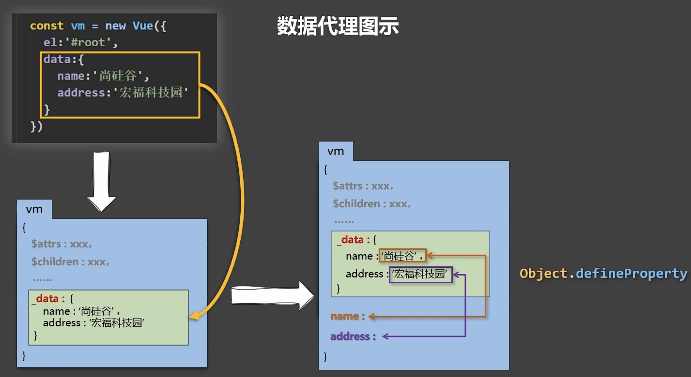

# Vue.js

Vue (读音 /vjuː/，类似于 **view**) 是一套用于构建用户界面的**渐进式框架**。与其它大型框架不同的是，Vue 被设计为可以自底向上逐层应用。Vue 的核心库只关注视图层，不仅易于上手，还便于与第三方库或既有项目整合。另一方面，当与[现代化的工具链](https://v3.cn.vuejs.org/guide/single-file-component.html)以及各种[支持类库(opens new window)](https://github.com/vuejs/awesome-vue#components--libraries) 结合使用时，Vue 也完全能够为复杂的单页应用提供驱动。


## Project setup
```
npm install
```

### Compiles and hot-reloads for development
```
npm run serve
```

### Compiles and minifies for production
```
npm run build
```

### Lints and fixes files
```
npm run lint
```

### Customize configuration
See [Configuration Reference](https://cli.vuejs.org/config/).


## MVVM

vue一定程度上参考了mvvm

（Model-View-ViewModel）架构

1. 『View』：视图层（UI 用户界面）
2. 『ViewModel』：业务逻辑层（一切 js 可视为业务逻辑）
3. 『Model』：数据层（存储数据及对数据的处理如增删改查）


### 组件

组件本质上是一个具有预定义选项的实例。在 Vue 中注册组件很简单：如对 `app` 对象所做的那样创建一个组件对象，并将其定义在父级组件的 `components` 选项中：

```js
const TodoItem = {
  template: `<li>This is a todo</li>`
}

// 创建 Vue 应用
const app = Vue.createApp({
  components: {
    TodoItem // 注册一个新组件
  },
  ... // 组件的其它 property
})

// 挂载 Vue 应用
app.mount(...)
```


## VUE2

尽量使用id选择器

不能挂载到单标签 html body


### 创建实例	Instance

```js
var app = new Vue({
    el:"",
    // data
})
```

当一个 Vue 实例被创建时，它将 `data` 对象中的所有的 property 加入到 Vue 的**响应式系统**中。当这些 property 的值发生改变时，视图将会产生“响应”，即匹配更新为新的值。

- 只有当实例被创建时就已经存在于 `data` 中的 property 才是**响应式**的。

- 例外是使用 `Object.freeze()`，这会阻止修改现有的 property，也意味着响应系统无法再*追踪*变化。
- 实例与容器 只能一一对应
- [API — 实例-property](https://cn.vuejs.org/v2/api/#实例-property)


### 绑定


```js
var app = new Vue({
    el:"root",	//element 元素
    //data
})
// or
app.$mount("root")	//挂载


```


### 指令

指令带有前缀 `v-`，以表示它们是 Vue 提供的特殊 attribute。它们会在渲染的 DOM 上应用特殊的响应式行为。

指令的职责是，当表达式的值改变时，将其产生的连带影响，响应式地作用于 DOM。


### 生命周期钩子

#### created

```js
new Vue({
  data: {
    a: 1
  },
  created: function () {                  //在一个实例被创建之后执行代码
    // `this` 指向 vm 实例
    console.log('a is: ' + this.a)
  }
})
// => "a is: 1"
```

- 不要在选项 property 或回调上使用箭头函数，因为没有this

#### mounted

#### updated

#### destroyed


### template 模板

允许开发者声明式地将 DOM 绑定至底层 Vue 实例的数据。所有 Vue.js 的模板都是合法的 HTML，所以能被遵循规范的浏览器和 HTML 解析器解析。

在底层的实现上，Vue 将模板编译成虚拟 DOM 渲染函数。结合响应系统，Vue 能够智能地计算出最少需要重新渲染多少组件，并把 DOM 操作次数减到最少。

```html
<template>不会影响原来的html结构</template>
```


### 文本插值

数据绑定最常见的形式就是使用“Mustache”语法 (双大括号) 的文本插值

用于标签体（<>标签体<>）

```html
<span>Message: {{ msg }}</span>

<span>Message: {{ object.msg }}</span>

```

通过使用 [v-once 指令](https://cn.vuejs.org/v2/api/#v-once)，你也能执行一次性地插值，当数据改变时，插值处的内容不会更新。但请留心这会影响到该节点上的其它数据绑定：

```html
<span v-once>这个将不会改变: {{ msg }}</span>
```

### 指令语法

用于标签（标签属性，标签体内容，绑定事件，，，）

#### v-html 可解析html

双大括号会将数据解释为普通文本，而非 HTML 代码。
为了输出真正的 HTML，需要使用 [`v-html` 指令](https://cn.vuejs.org/v2/api/#v-html)：

```html
<p>Using mustaches: {{ rawHtml }}</p>
<p>Using v-html directive: <span v-html="rawHtml"></span></p>
```


#### v-bind 单向数据绑定

Mustache 语法不能作用在 HTML attribute(属性 class style...) 上，遇到这种情况应该使用 [`v-bind` 指令](https://cn.vuejs.org/v2/api/#v-bind)

```html
<div v-bind:id="dynamicId"></div>
```


```html
<!-- 完整语法 -->
<a v-bind:href="url">...</a>

<!-- 缩写 -->
<a :href="url">...</a>

<!-- 动态参数的缩写 (2.6.0+) -->
<a :[key]="url"> ... </a>
```


#### v-model 双向数据绑定

同步变化！

只能应用在表单（输入）类元素中

input 单选 多选 select 多行输入文本块

​                                                                                                         

#### v-on 事件监听

==》》事件处理

```html
<div id="app-5">
  <p>{{ message }}</p>
  <button v-on:click="reverseMessage">反转消息</button>
</div>
```

```js
var app5 = new Vue({
  el: '#app-5',
  data: {
    message: 'Hello Vue.js!'
  },
  methods: {
    reverseMessage: function () {
      this.message = this.message.split('').reverse().join('')
    }
  }
})
```

```html
<!-- 完整语法 -->
<a v-on:click="doSomething">...</a>

<!-- 缩写 -->
<a @click="doSomething">...</a>

<!-- 动态参数的缩写 (2.6.0+) -->
<a @[event]="doSomething"> ... </a>
```


#### v-cloak	

配合`display:none;`

防止未经解析的模板渲染到页面上


#### v-pre

跳过所在节点的vue解析渲染，维持原html渲染方法，跳过-->>加速编译


### 自定义指令

#### 对象形式
```js
directives:{
	instra(domElement,valueBinding){
        //绑定的DOM	指令指定的value
	domElement.focus ()
    }
}
//执行：1.成功绑定（而不是成功渲染）	2.重新解析

```
#### 对象形式
```js
instra:{
    //成功绑定
    bind(){},
        //渲染到页面
    inserted(){},
        //更新
    update(){},
}
```

#### 全局指令 

```js
Vue.instra('fbind',{
    bind(e,b){
        
    },
    inserted(e,b){
        
    }
})
```


### js 表达式

对于所有的数据绑定，Vue.js 都提供了完全的 JavaScript 表达式支持。

- 每个绑定都只能包含**单个表达式**，所以下面的例子都**不会**生效。

- 只是表达式,if啥的不行

- 可以用方括号括起来的 JavaScript 表达式作为一个指令的参数--**动态参数**


### 计算属性 
模板内的复杂逻辑

```html
<div id="example">
  <p>Original message: "{{ message }}"</p>
  <p>Computed reversed message: "{{ reversedMessage }}"</p>
</div>
```
```js
var vm = new Vue({
  el: '#example',
  data: {
    message: 'Hello'
  },
    //完整形式
computed:{
    fullName:{
        //get有什么作用？当有人读取fullName时，get就会被调用，且返回值就作为fullName的值
        //get什么时候调用？1.初次读取fullName时。2.所依赖的数据发生变化时。
        get(){
            console.log('get被调用了')
            // console.log(this) //此处的this是vm
            return this.firstName + '-' + this.lastName
        },
        //set什么时候调用? 当fullName被修改时。
        set(value){
            console.log('set',value)
            const arr = value.split('-')
            this.firstName = arr[0]
            this.lastName = arr[1]
        }  
    
//简写 只有getter
  computed: {
    // 计算属性的 getter(捕获)
    reversedMessage: function () {
      // `this` 自动指向 vm 实例
      return this.message.split('').reverse().join('')
    }
  }
})
```

性能优于方法

**计算属性是基于它们的响应式依赖进行缓存的**。只在相关响应式依赖发生改变时它们才会重新求值。
只要 `message` 还没有发生改变，多次访问 `reversedMessage` 计算属性会立即返回之前的计算结果，而不必再次执行函数。

​          1.定义：要用的属性不存在，要通过已有属性计算得来。

​          2.原理：底层借助了Objcet.defineproperty方法提供的getter和setter。

​          3.get函数什么时候执行？

​                (1).初次读取时会执行一次。

​                (2).当依赖的数据发生改变时会被再次调用。

​          4.优势：与methods实现相比，内部有缓存机制（复用），效率更高，调试方便。

​          5.备注：

​              1.计算属性最终会出现在vm上，直接读取使用即可。

​              2.如果计算属性要被修改，那必须写set函数去响应修改，且set中要引起计算时依赖的数据发生改变。

​		6.简写时，只有getter没有setter

```html
<p>Reversed message: "{{ reversedMessage() }}"</p>
```


### 对象语法

我们可以传给 `v-bind:class` 一个对象，以动态地切换 class：

```
<div v-bind:class="{ active: isActive }"></div>
```

上面的语法表示 `active` 这个 class 存在与否将取决于数据 property `isActive` 的 [truthiness](https://developer.mozilla.org/zh-CN/docs/Glossary/Truthy)。


### 事件处理

```html
			<input type="text" placeholder="按下回车提示输入" @keydown.enter="showInfo">
			<input type="text" placeholder="按下-抬起空格提示输入" @keyup.space="showInfo">

<script>
new Vue({
    el:" ",
    methods:{	//对应的事件函数写在methods
        showinfo(){
            
        }
    }
})
</script>
```

#### 基本

​        事件的基本使用：

​              1.使用v-on:xxx 或 @xxx 绑定事件，其中xxx是事件名；

​              2.事件的回调需要配置在methods对象中，最终会在vm上；

​              3.methods中配置的函数，不要用箭头函数！否则this就不是vm了；

​              4.methods中配置的函数，都是被Vue所管理的函数，this的指向是**vm** 或 **组件实例对象**；

​              5.`@click="demo"` 和 `@click="demo($event)"` 效果一致，但后者可以传参；

#### 事件修饰

​        Vue中的事件修饰符：

​            1.prevent：阻止默认事件（常用）；

​            2.stop：阻止事件冒泡--如内部点击触发外部（常用）；

​            3.once：事件只触发一次（常用）；

​            4.capture：使用事件的捕获模式；

​            5.self：只有event.target是当前操作的元素时才触发事件；

​            6.passive：事件的默认行为立即执行，无需等待事件回调执行完毕；

//可多用，有先后顺序

`@onclick.prevent.once`


#### 按键事件

​        1.Vue中常用的按键别名：
​              回车 => enter
​              删除 => delete (捕获“删除”和“退格”键)
​              退出 => esc
​              空格 => space
​              换行 => tab (特殊，必须配合keydown去使用)
​              上 => up
​              下 => down
​              左 => left
​              右 => right


​        2.Vue未提供别名的按键，可以使用按键原始的key值去绑定，但两个单词的按键注意要转为kebab-case（短横线命名）


​        3.系统修饰键（用法特殊）：ctrl、alt、shift、meta
​              (1).配合keyup使用：按下修饰键的同时，再按下其他键，随后释放其他键，事件才被触发。
​              (2).配合keydown使用：正常触发事件。

​        4.也可以使用keyCode去指定具体的按键（不推荐）

​        5.Vue.config.keyCodes.自定义键名 = 键码，可以去定制按键别名


### 事件监听
#### getter()

#### setter()

```js
Object.defineProperty( object,'property' ){
    value: 19,
    enumerable:[false],	      //是否可枚举
    writable:[false],		//是否可修改
    configurable:[false]	//是否可删除    
    
    get:function(){			//当有人读取object.property时get函数（getter)就会被调用，读取到的值就是get的值
        return 变量			//实现了类似model的绑定效果 property--变量
    }
    
    set:function(value){		//当有人读取object.property时set函数（setter)就会被调用，且value会收到修改的具体值
    	console.log('property被修改，值为',value),
        obj.x=value			//实现数据代理
    } 
}


```


### 数据代理

通过一个对象代理 对另一个对象中的属性的操作

getter()

setter()

vue实例(vm)中的`data:`会保存到vm._data(对象)




### 监视/侦听	wacth:

```
1. 通过通过vm对象的$watch()或watch配置来监视指定的属性
2. 当属性变化时,回调函数自动调用,在函数内部进行计算


```


 1.当被监视的属性**变化**时, 回调函数自动调用, 进行相关操作

 2.监视的属性必须存在，才能进行监视！！

3.监视的两种写法：

​          (1)new Vue时传入`watch:`配置

​          (2).通过`vm.$watch`监视

 

#### 深度监视

 属性的初始值都是带引号的。

配置的时候可以简写，不加引号，单调用的时后一定要加

- 多级结构中的某个属性

```js
new Vue{
watch:{
    “number.a”:{
	handler(newvalue,oldvalye){
        
    }}}}
```

- 多级结构 深度

    `deep:true`

- `immediate:true,` //初始化时让handler调用一下

#### 简写

```js
isHot(newValue,oldValue){
	console.log('isHot被修改了',newValue,oldValue,this)
}
```

不能再配置deep,immediate


- 监视可以开启异步任务


### 显示/隐藏	  条件渲染

1.`v-if`

写法：

	(1).v-if="表达式" 
	
	(2).v-else-if="表达式"
	
	(3).v-else="表达式"
	
	适用于：切换频率较低的场景。
	
	特点：不展示的DOM元素直接被移除。
	
	注意：v-if可以和:v-else-if、v-else一起使用，但要求结构不能被“打断”。


 2.`v-show`

	 写法：v-show="表达式"
	
	适用于：切换频率较高的场景。
	
	特点：不展示的DOM元素未被移除，仅仅是使用样式display隐藏掉


​             

 3.备注：使用v-if的时，元素可能无法获取到，而使用v-show一定可以获取到。

	`v-if` 有更高的切换开销，而 `v-show` 有更高的初始渲染开销


### 列表渲染

遍历array/object/string /指定次数

```html
<li v-for="(p,index) in person":key="p.id">{{p.name}}-{{p.age}}</li>
```

```js
data:{
    person:{
        {id:"001",name:"hh",age:"18",,}
    }
}
```

#### key:唯一标识元素，尽量不用index

面试题：react、vue中的key有什么作用？（key的内部原理）

1. 虚拟DOM中key的作用：
key是虚拟DOM对象的标识，当数据发生变化时，Vue会根据【新数据】生成【新的虚拟DOM】, 
随后Vue进行【新虚拟DOM】与【旧虚拟DOM】的差异比较，比较规则如下：

2. 对比规则：
    (1).旧虚拟DOM中找到了与新虚拟DOM相同的key：
        ①.若虚拟DOM中内容没变, 直接使用之前的真实DOM！
        ②.若虚拟DOM中内容变了, 则生成新的真实DOM，随后替换掉页面中之前的真实DOM。

​		(2).旧虚拟DOM中未找到与新虚拟DOM相同的key
​        创建新的真实DOM，随后渲染到到页面。
​        

3. 用index作为key可能会引发的问题：
    1. 若对数据进行：逆序添加、逆序删除等破坏顺序操作:
        会产生没有必要的真实DOM更新 ==> 界面效果没问题, 但效率低。

    2. 如果结构中还包含输入类的DOM：
        会产生错误DOM更新 ==> 界面有问题。

4. 开发中如何选择key?:
    1.最好使用每条数据的唯一标识作为key, 比如id、手机号、身份证号、学号等唯一值。
    2.如果不存在对数据的逆序添加、逆序删除等破坏顺序操作，仅用于渲染列表用于展示，使用index作为key是没有问题的。

#### 列表过滤

-->>筛选/搜索


### 组件

1. 创建组件

```js
const top = Vue.extend({
    template:`
    <div>
    </div>`
    //不写el 由vm分配
    //函数式DATA 
    data(){
        return{
            a:"b",
            
            
        }
    }
})
```


2. 注册组件

```js
new Vue({	//局部注册,只能用于当前vm实例
    el:"#root",
    conponents:{
        ‘组件名’：组件
    }
})


Vue.component('组件名',组件)	//全局注册
```


3. 使用组件

​	


1. 关于组件名:

- 一个单词组成：
    - 第一种写法(首字母小写)：school
    - 第二种写法(首字母大写)：School

- 多个单词组成：

    - 第一种写法(kebab-case命名)：my-school

    - 第二种写法(CamelCase命名)：MySchool (需要Vue脚手架支持)

- 备注：

    - (1).组件名尽可能回避HTML中已有的元素名称，例如：h2、H2都不行。

    - (2).可以使用`name配置项`指定组件在开发者工具中呈现的名字。--在创建组件时指定name

2. 关于组件标签:

- 第一种写法：`<school></school>`

- 第二种写法：`<school/>`

- 备注：不用使用脚手架时，<school/>会导致后续组件不能渲染。


3. 一个简写方式：

- `const school = Vue.extend({options})` 可简写为：`const school = {options}`


#### 组件嵌套

#### 组件实质

构造函数`VueComponent`

每次使用组件，Vue都会自动调用一个全新的`VueComponent`


this的指向

(1)组件配置中：

data函数、methods中的函数、watch中的函数、computed中的函数 它们的this均是【`VueComponent`实例对象vc功能与vm相同】。

(2)new Vue(options)配置中：

data函数、methods中的函数、watch中的函数、computed中的函数 它们的this均是【`Vue`实例对象vm】。


1.一个重要的内置关系：VueComponent.prototype.__proto__ === Vue.prototype

2.为什么要有这个关系：让组件实例对象（vc）可以访问到 Vue原型上的属性、方法。


## CLI

command line interface	命令行接口工具--脚手架

### webpack配置
webpack.config.js

####关闭语法检查--lintOnSave
```js
  lintOnSave:false
```

[vue.config.js]([配置参考 | Vue CLI (vuejs.org)](https://cli.vuejs.org/zh/config/))

