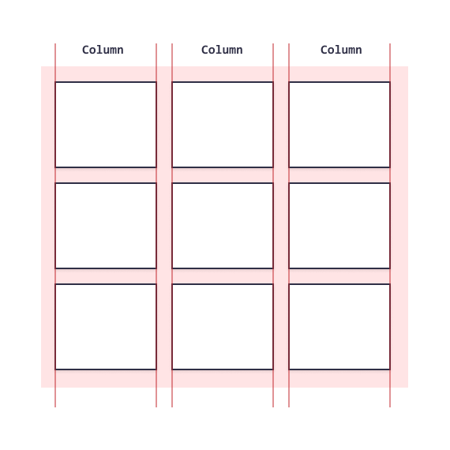

# 布局

## 默认

框架

```html
<html>

<frameset cols="25%,50%,25%"> <!-- rows垂直-水平 -->

  <frame src="/example/html/frame_a.html">
  <frame src="/example/html/frame_b.html">
  <frame src="/example/html/frame_c.html">

</frameset>

</html>

```


## 弹性盒子

```css
section {
  display:flex
}

article {
  flex-direction: row;/*默认弹性方向*/
  flex-wrap: wrap;  /*换行*/
  flex: 200px;		/*最小宽度*/
  flex: 1;   		/*动态尺寸占比*/
}

<div class="flex-container">
  <div>1</div>
  <div>2</div>
  <div>3</div>
</div>
```


##### 对齐

```css
div {
  display: flex;
  align-items: center;
  justify-content: space-around;
}
```

[`align-items`](https://developer.mozilla.org/zh-CN/docs/Web/CSS/align-items) 控制 flex 项在交叉轴上的位置。

- 默认的值是 `stretch`，其会使所有 flex 项沿着交叉轴的方向拉伸以填充父容器。如果父容器在交叉轴方向上没有固定宽度（即高度），则所有 flex 项将变得与最长的 flex 项一样长（即高度保持一致）。我们的第一个例子在默认情况下得到相等的高度的列的原因。
- 在上面规则中我们使用的 `center` 值会使这些项保持其原有的高度，但是会在交叉轴居中。这就是那些按钮垂直居中的原因。
- 你也可以设置诸如 `flex-start` 或 `flex-end` 这样使 flex 项在交叉轴的开始或结束处对齐所有的值。查看 [`align-items`](https://developer.mozilla.org/zh-CN/docs/Web/CSS/align-items) 了解更多。

[`justify-content`](https://developer.mozilla.org/zh-CN/docs/Web/CSS/justify-content) 控制 flex 项在主轴上的位置。

- 默认值是 `flex-start`，这会使所有 flex 项都位于主轴的开始处。**左**
- 你也可以用 `flex-end` 来让 flex 项到结尾处。**右**
- `center` 在 `justify-content` 里也是可用的，可以让 flex 项在主轴居中。**居中**
- 而我们上面用到的值 `space-around` 是很有用的——它会使所有 flex 项沿着主轴均匀地分布，在任意一端都会留有一点空间。**均匀**
- 还有一个值是 `space-between`，它和 `space-around` 非常相似，只是它**不会在**两端留下任何空间。

##### 再排序

不影响DOM

```CSS
button:first-child {
  order: 1;
}
```

- 所有 flex 项默认的 [`order`](https://developer.mozilla.org/zh-CN/docs/Web/CSS/order) 值是 0。
- order 值大的 flex 项比 order 值小的在显示顺序中更靠后。
- 相同 order 值的 flex 项按源顺序显示。所以假如你有四个元素，其 order 值分别是2，1，1和0，那么它们的显示顺序就分别是第四，第二，第三，和第一。
- 第三个元素显示在第二个后面是因为它们的 order 值一样，且第三个元素在源顺序中排在第二个后面。

#### 网格

网格是由一系列水平及垂直的线构成的一种布局模式。

一个网格通常具有许多的**列（column）**与**行（row）**，以及行与行、列与列之间的间隙，这个间隙一般被称为**沟槽（gutter）**。

```css
.container {
  display: grid;
  grid-template-columns: 200px 200px 200px;
    
  grid-template-columns: repeat(3, 1fr);	/*重复构建*/
  grid-gap: 20px;
}
```

##### 隐式网格-行

格局内容自动创建，auto 自动调整

```css
.container {
  display: grid;
  grid-template-columns: repeat(3, 1fr);
  grid-auto-rows: 100px;
  grid-gap: 20px;
}
```

##### [`minmax`](https://developer.mozilla.org/zh-CN/docs/Web/CSS/minmax) 函数

为一个行/列的尺寸设置了取值范围。比如设定为 **`minmax(100px, auto)`**，那么尺寸就至少为100像素，并且如果内容尺寸大于100像素则会根据内容自动调整。

##### autofill

自动填满容器

```css
.container {
  display: grid;
  grid-template-columns: repeat(auto-fill, minmax(200px, 1fr));
  grid-auto-rows: minmax(100px, auto);
  grid-gap: 20px;
}
```

##### 基于线

定义网格之后

开始/结束

```css
header {
  grid-column: 1 / 3;
  grid-row: 1;
}

article {
  grid-column: 2;
  grid-row: 2;
}

aside {
  grid-column: 1;
  grid-row: 2;
}

footer {
  grid-column: 1 / 3;
  grid-row: 3;
}
```


##### grid-template-areas

```css
.container {
  display: grid;
  grid-template-areas:
      "header header"
      "sidebar content"
      "footer footer";
  grid-template-columns: 1fr 3fr;
  grid-gap: 20px;
}

header {
  grid-area: header;
}

article {
  grid-area: content;
}

aside {
  grid-area: sidebar;
}

footer {
  grid-area: footer;
}
```

---

## 网格布局




```css
.grid-container {
  display: grid;
  display:inline-grid;
  height: 400px;
  grid-template-columns: auto auto auto auto;/*网格布局行列数 每列宽度*/
  align-content: center;
}
```


#### 定位

```css
.item1 {
  grid-column-start: 1;
  grid-column-end: 3;
  grid-area: /*简写属性*/;
}
```


# 响应式设计

Responsive Web Design

框架：Bootstrap


### 媒体查询

#### 视口

```css
@media screen and (min-width: 480px) {
  #leftsidebar {width: 200px; float: left;}
  #main {margin-left: 216px;}
}
```
